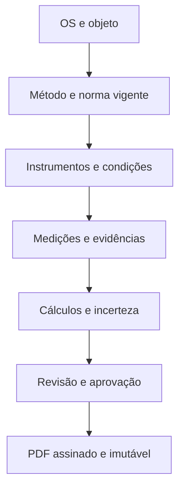

# Auditoria completa do SIVS SECCOL 2.1

**Relatório técnico, funcional, operacional, de segurança, conformidade, dados, experiência do usuário e aderência ao negócio**

| Identificação | Valor |
|---|---|
| Sistema auditado | SIVS SECCOL |
| Versão declarada | 2.1.0 |
| Pacote auditado | `SIVS_2.1_SECCOL_CADASTROS_ESPECIALIZADOS.zip` |
| SHA-256 do pacote | `373bbf8bb4b16de70e2bfd1fc02db2d2296f9b86e42dfdc0793f8da6e55b8594` |
| Data da auditoria | 15 de agosto de 2026 |
| Escopo | Código-fonte, banco, API, interface, PWA, cadastros, fluxos, segurança, multiempresa, licitações, normas, laudos, qualidade, fiscal, financeiro, XML, Mobile, operação, documentação e testes |
| Base de comparação | Necessidades declaradas pela SECCOL, site público da SECCOL, manual público do SIVS original e fontes oficiais indicadas ao final |
| Natureza | Auditoria independente de engenharia de software; não é certificação ISO, acreditação laboratorial, parecer jurídico, contábil ou fiscal |

## Sumário

1. Parecer executivo
2. Método, evidências e limitações
3. Inventário técnico completo
4. Matriz dos 48 módulos
5. Segurança, identidade, privacidade e autorização
6. Multiusuário, multiempresa e colaboração
7. Integridade, modelo de dados e relacionamentos
8. Licitações, editais, fontes e inteligência comercial
9. Portfólio SECCOL, produtos, serviços e instrumentos
10. Normas, laudos, estudos, certificados e metrologia
11. Sistema de gestão da qualidade e ISO/IEC 17025
12. Importação XML, fiscal, compras, estoque e financeiro
13. Mobile e PWA
14. Interface, menu, identidade SECCOL e acessibilidade
15. Backup, importação, continuidade e recuperação
16. Operação, implantação, observabilidade e manutenção
17. Testes e qualidade de engenharia
18. Documentação, transparência e coerência de produto
19. Registro mestre consolidado de achados
20. Aderência aos pedidos da SECCOL e ao SIVS original
21. Plano total de correção e evolução
22. Critérios de aceite por fluxo crítico
23. Checklist de liberação para produção
24. Fontes de referência
25. Conclusão final

---

## 1. Parecer executivo

### 1.1 Decisão objetiva

**O SIVS SECCOL 2.1 não deve ser liberado, no estado atual, como sistema de produção, sistema exposto em rede, sistema fiscal/financeiro oficial ou plataforma de emissão de laudos/certificados acreditados.**

Ele pode ser usado como **protótipo funcional e piloto interno controlado**, preferencialmente em máquina local, com dados de teste, porque já entrega:

- autenticação e sessões;
- separação básica de empresas nos registros;
- 48 módulos persistentes em banco;
- cadastro genérico com formulários especializados na interface;
- assuntos e relacionamentos;
- anexos, histórico básico e lixeira;
- catálogo inicial da SECCOL;
- catálogo de 38 fontes de prospecção/licitação;
- pesquisa manual real no PNCP com contingência parcial do Compras.gov.br;
- importação inicial de XML de NF-e;
- aprovações simples;
- visão Mobile básica para ordens de serviço;
- PWA de casca;
- exportação/importação de dados;
- 13 testes automatizados aprovados.

Entretanto, há bloqueadores que impedem o uso seguro e juridicamente confiável:

1. corrida no primeiro cadastro permite a criação simultânea de mais de um administrador não autenticado;
2. perfis sem permissão de escrita conseguem ler e exportar módulos sensíveis fora de seu escopo;
3. as validações dos formulários especializados existem principalmente no navegador e podem ser ignoradas pela API;
4. valores infinitos geram JSON inválido e podem quebrar o cliente;
5. importações malformadas podem derrubar a conexão sem resposta controlada;
6. não há TLS incorporado, o cookie não usa `Secure`, não há MFA, limitação de tentativas nem política operacional de senhas;
7. banco, anexos e backups ficam em texto claro;
8. o backup chamado de completo não contém usuários, vínculos empresariais, auditoria, versões nem notificações;
9. laudos, estudos e certificados são apenas cadastros; não há motor de cálculo, geração documental, assinatura, rastreabilidade metrológica completa nem emissão imutável;
10. as normas integrais licenciadas não estão anexadas; há somente fichas autorais e links;
11. a automação fiscal é apenas uma fila local, sem transmissão real;
12. o financeiro não é contabilidade nem tesouraria completa e o painel pode contar a mesma receita mais de uma vez;
13. a agenda de pesquisa de editais não executa sozinha;
14. o progresso visual da busca é parcialmente baseado em tempo, não em telemetria real do backend;
15. o Mobile não restringe as ordens ao técnico responsável e não opera offline;
16. não existem migrações versionadas, monitoramento, recuperação testada, serviço de produção, logs estruturados ou plano de continuidade;
17. a interface contém textos muito pequenos, contrastes insuficientes e lacunas de acessibilidade;
18. a documentação faz afirmações mais amplas que o comportamento efetivamente comprovado.

### 1.2 Respostas diretas às principais dúvidas da direção

| Pergunta | Resposta auditada |
|---|---|
| A pesquisa de editais está funcionando? | **Sim, quando disparada manualmente.** Dois testes reais concluíram sem erro: o teste técnico SECCOL em GO retornou 0; o teste de controle nacional retornou 40 oportunidades e persistiu 40 registros. A cobertura da fonte, contudo, não é exaustiva. |
| Existe “Pesquisar agora”? | **Sim.** Está na tela de pesquisa de editais e chama `POST /api/tenders/search`. |
| O usuário sabe o que está acontecendo? | **Parcialmente.** Há animação, etapas e estados de fonte; as etapas avançam por temporizador e não representam cada requisição real. O resultado final é real. |
| As fontes estão cadastradas? | **Sim, 38.** Apenas PNCP é automático primário e Compras.gov.br é contingência. As demais são manuais ou de prospecção. |
| A agenda pesquisa automaticamente? | **Não.** Ela salva filtros e `next_run_at`, mas não há trabalhador/agendador executando o plano. |
| É multiusuário? | **Parcialmente.** Há usuários, sessões, oito perfis e empresas; a leitura é excessivamente ampla, as permissões finas não são aplicadas e a implantação padrão é local. |
| É multiempresa? | **O núcleo de registros é funcional**, com isolamento por `company_id` e troca de empresa validada. Há lacunas em autorização, identidade e operação. |
| Todos os cadastros têm assunto/relacionamento? | **Na interface, em grande parte sim; na API, não.** A obrigatoriedade pode ser contornada, e muitos vínculos de negócio ainda são texto livre. |
| Existe local para laudos, estudos e certificados? | **Sim, como cadastro.** |
| A confecção é automatizada e parametrizada? | **Não.** Não há modelos, cálculos, medições, incerteza, critérios, geração PDF/DOCX, assinatura ou emissão controlada. |
| As normas fundamentam laudos e estudos? | **Parcialmente.** Exige-se ao menos uma norma ativa ligada em três módulos; não há matriz completa serviço × método × ensaio × norma × edição. |
| As normas estão anexadas? | **Somente fichas de referência.** Os textos integrais, sujeitos a licença, não estão incluídos. |
| O Mobile foi desenvolvido? | **Apenas um subconjunto.** Iniciar, pausar, retomar e concluir OS funciona; faltam atribuição individual, assinatura, fotos, peças, offline, agenda operacional e demais fluxos do original. |
| O módulo fiscal transmite documentos? | **Não.** Registra eventos locais ou aguarda conector. |
| O backup é recuperação completa de desastre? | **Não.** O rótulo atual é enganoso. |
| O sistema está mais bonito que o original? | **Há uma direção visual premium SECCOL**, mas ainda há inconsistência de cores, ícones improvisados, tipografia excessivamente pequena e ausência de validação visual completa em navegadores/dispositivos. |

### 1.3 Nível de maturidade

Escala usada: `0 = ausente`, `1 = protótipo`, `2 = funcional básico`, `3 = operacional controlado`, `4 = produção madura`, `5 = alta criticidade/auditável`.

| Dimensão | Nota | Justificativa resumida |
|---|---:|---|
| Cobertura funcional aparente | 2,5/5 | Muitos menus e cadastros, mas grande parte usa CRUD genérico. |
| Arquitetura e manutenibilidade | 1,8/5 | Simples e portátil, porém monolítica, sem camadas, migrações ou contrato de API. |
| Segurança | 1,2/5 | Há hashing, CSRF e isolamento básico; existem falhas críticas de setup, leitura e operação. |
| Multiempresa | 3,0/5 | `company_id` é aplicado no núcleo e foi testado. |
| Multiusuário e autorização | 1,8/5 | Oito perfis de escrita; leitura indiscriminada e permissões finas inativas. |
| Integridade e governança de dados | 1,5/5 | Versionamento e relações básicos; validação e constraints insuficientes. |
| Licitações e inteligência comercial | 2,1/5 | Busca real e catálogo; cobertura, agenda e fluxo de disputa incompletos. |
| Laudos, estudos e certificação | 0,8/5 | Estrutura cadastral sem motor técnico/documental. |
| Qualidade/ISO 17025 | 1,3/5 | Cadastros iniciais sem sistema completo de gestão laboratorial. |
| Fiscal | 0,6/5 | Fila local sem integração/transmissão. |
| Financeiro | 1,0/5 | CRUD sem razão contábil, liquidação, conciliação ou controles financeiros completos. |
| Mobile/PWA | 1,1/5 | Tela responsiva básica; offline e fluxos de campo ausentes. |
| UX e acessibilidade | 1,8/5 | Boa intenção visual, mas legibilidade, contraste e coerência precisam de revisão. |
| Testes e qualidade de entrega | 1,5/5 | 13 testes passam; cobertura aproximada baixa e quase nenhum teste de navegador/adversarial. |
| Operação, observabilidade e continuidade | 0,9/5 | Inicializador local, sem produção assistida, métricas, backups automáticos ou DR. |
| **Maturidade global estimada** | **1,6/5** | **Protótipo amplo, ainda não produto de produção.** |

> As notas são um instrumento de priorização, não uma certificação externa nem uma medida matemática de “100 vezes melhor”. A evolução deve ser comprovada por critérios objetivos, testes e indicadores.

---

## 2. Método, evidências e limitações

### 2.1 Evidências inspecionadas

- pacote ZIP e diretório extraído, comparados byte a byte;
- `server.py`, `launcher.py`, scripts de início e banco SQLite;
- `static/index.html`, `static/app.js`, `static/styles.css`, manifest e service worker;
- README, changelog e auditorias anteriores;
- testes unitários e de API;
- esquema e conteúdo inicial de banco novo;
- 48 módulos, 46 esquemas de formulário e 46 perfis de cadastro especializados;
- oito papéis de acesso;
- 19 tabelas de domínio/infraestrutura;
- 38 fontes de pesquisa;
- 18 referências normativas;
- sete famílias de produtos, 12 instrumentos e 29 serviços pré-cadastrados;
- manual público do SIVS original;
- site público da SECCOL;
- APIs e documentação oficial do PNCP e Compras.gov.br;
- páginas oficiais das normas e critérios WCAG;
- testes de comportamento normal e adversarial em bancos temporários descartáveis.

### 2.2 Comandos e testes executados

| Verificação | Resultado |
|---|---|
| `python3 -m unittest discover -s tests -v` | **13/13 aprovados** |
| `python3 -m py_compile server.py launcher.py` | Aprovado |
| `node --check static/app.js` | Aprovado |
| Comparação do ZIP com o diretório auditado | Sem diferenças |
| `PRAGMA integrity_check` em banco novo | `ok` |
| `PRAGMA foreign_key_check` | Sem violações no estado inicial |
| Cobertura aproximada por rastreamento das linhas de instrução Python | **43,6%**; não equivale a cobertura de ramos |
| Busca real PNCP: termos SECCOL, GO, 3 dias, modalidade 8 | HTTP 200; 4/4 páginas; 14,12 s; 0 achados; histórico gravado |
| Busca real PNCP: “manutenção”, Brasil, 3 dias, modalidade 8 | HTTP 200; 4/4 páginas; 10,52 s; 40 achados e 40 novos persistidos |
| Corrida simultânea no setup | Duas respostas HTTP 200 e dois administradores criados |
| Cadastro especializado incompleto via API | Aceito com HTTP 201 |
| Status e data arbitrários via API | Aceitos |
| Valor `1e309` | Aceito; resposta contém `Infinity`, inválido em JSON estrito |
| Importação `{"records":[1]}` | Exceção não tratada e conexão encerrada |
| Leitura por técnico de financeiro/configuração/auditoria/lixeira/aprovações | HTTP 200 em todos os casos testados |
| Exportação por viewer | Permitida, inclusive com registro excluído logicamente |
| Aprovações pendentes duplicadas | Duas solicitações aceitas |

### 2.3 Limitações da auditoria

Não foram realizados:

- pentest externo completo com exploração em infraestrutura real;
- teste de carga prolongado com centenas de usuários;
- inspeção visual pixel a pixel em todos os navegadores e dispositivos, pois não havia implantação pública acessível ao navegador de validação;
- validação jurídica da LGPD, tributária ou trabalhista;
- auditoria contábil;
- acreditação ou avaliação oficial contra ISO/IEC 17025;
- validação do conteúdo integral de normas protegidas por direitos autorais;
- transmissão real a SEFAZ, prefeitura, banco ou serviço de boletos, pois os conectores não existem;
- confirmação documental de fabricação própria de cada item do portfólio. A afirmação “tudo no site a SECCOL tem ou produz” foi tratada como **premissa declarada pela direção**, a ser formalizada no cadastro mestre.

### 2.4 Legenda de estado usada no relatório

| Estado | Significado |
|---|---|
| **Comprovado** | Executado ou confirmado por código, banco e teste. |
| **Parcial** | Existe parte útil, mas faltam elementos essenciais. |
| **Somente interface** | A tela/campo existe sem regra equivalente no servidor ou processo real. |
| **Simulado** | A interface representa atividade sem telemetria real equivalente. |
| **Ausente** | Não foi encontrado no pacote auditado. |
| **Não verificado** | Exige ambiente, licença, credencial ou evidência externa indisponível. |

---

## 3. Inventário técnico completo

### 3.1 Estrutura e tecnologia

| Componente | Implementação | Avaliação |
|---|---|---|
| Backend | Python padrão, `ThreadingHTTPServer`, aproximadamente 3.054 linhas em um arquivo principal | Portátil, mas monolítico e difícil de evoluir com segurança. |
| Persistência | SQLite, WAL e chaves estrangeiras ativadas | Adequado a piloto de baixa concorrência; exige testes e disciplina para produção multiusuário. |
| Frontend | HTML, CSS e JavaScript sem framework | Simples de distribuir; arquivo JS grande e acoplado. |
| PWA | Manifest + service worker | Casca parcial; sem ícones e sem dados offline. |
| Autenticação | Sessão em cookie, PBKDF2-HMAC-SHA256, 310 mil iterações | Base positiva; faltam controles de conta e transporte. |
| API | Rotas HTTP próprias, JSON | Sem OpenAPI, versão de contrato, middleware de erro ou validação central. |
| Anexos | BLOB dentro do SQLite | Simples; ruim para escala, antivírus, retenção e recuperação seletiva. |
| Implantação | `launcher.py`, `.bat` e `.sh` | Inicialização local, não serviço de produção. |
| Dependências | Biblioteca padrão | Superfície de supply chain pequena; faltam ferramentas maduras para segurança/validação. |

### 3.2 Volumetria do código auditado

| Artefato | Tamanho aproximado |
|---|---:|
| `server.py` | 179.073 bytes |
| `static/app.js` | 138.143 bytes |
| `static/styles.css` | 63.862 bytes |
| `static/index.html` | 16.415 bytes |
| `tests/test_server.py` | 18.908 bytes |
| `tests/test_frontend_contract.py` | 1.712 bytes |
| Total aproximado dos principais arquivos | 5.776 linhas |

### 3.3 Tabelas do banco

| Tabela | Finalidade | Lacuna principal |
|---|---|---|
| `companies` | Empresas/tenants | Sem hierarquia de filial/unidade/centro de custo. |
| `users` | Identidade global | Papel legado duplicado; sem MFA, reset ou política de ciclo de vida. |
| `company_memberships` | Vínculo usuário-empresa e papel | Coluna `permissions` existe, mas não é aplicada. |
| `sessions` | Sessões autenticadas | Sem tela de sessões, revogação, dispositivo ou risco. |
| `settings` | Configuração legada | Convivência pouco clara com `company_settings`. |
| `company_settings` | Configurações por empresa | Leitura ampla e potencial exposição de dados sensíveis. |
| `records` | Todos os 48 módulos genéricos | Poucas constraints; JSON livre concentra regras de negócio. |
| `subjects` | Assuntos por empresa | Regra de obrigatoriedade não é aplicada no backend. |
| `record_subjects` | Relação registro-assunto | Sem política forte para assunto principal no servidor. |
| `record_relationships` | Relações entre registros | Tipo livre; sem cardinalidade/semântica completa. |
| `record_versions` | Fotografias de versões | Sem navegação/restauração geral e sem FK explícita para o registro. |
| `attachments` | Arquivos anexos | BLOB, sem hash, antivírus, tipo real, retenção ou exclusão. |
| `audit_log` | Ações auditadas | Não imutável; não registra todas as leituras/downloads/exportações. |
| `notifications` | Avisos internos | Fluxos e entrega limitados. |
| `approvals` | Aprovações simples | Sem segregação, versão aprovada, níveis, alçadas ou assinatura. |
| `tender_results` | Oportunidades de editais | Sem itens/lotes/documentos completos e sem paginação. |
| `tender_searches` | Histórico de pesquisas | Sem diagnóstico detalhado por página/fonte. |
| `search_schedules` | Planos de monitoramento | Não existe executor em segundo plano. |
| `fiscal_events` | Fila/eventos fiscais locais | Não existe conector/transmissão real. |

### 3.4 Superfície de API

| Grupo | Rotas principais | Observação |
|---|---|---|
| Estado/autenticação | `/api/status`, `/api/setup`, `/api/login`, `/api/logout`, `/api/me` | Setup vulnerável a corrida; controles de conta incompletos. |
| Empresa/usuários | `/api/companies`, `/api/company/switch`, `/api/users`, `/api/users/{id}` | Vínculo multiempresa existe; permissão fina não. |
| Cadastros | `/api/records`, `/api/records/{id}`, `/api/trash`, `/api/restore/{id}` | CRUD genérico, validação de domínio insuficiente. |
| Assuntos/relações | `/api/subjects`, `/api/subjects/{id}`, `/api/relations/options` | Relações úteis, porém pouco tipadas. |
| Anexos | `/api/records/{id}/attachments`, `/api/attachments/{id}` | Sem política de arquivo robusta. |
| Aprovação | `/api/records/{id}/approval`, `/api/approvals`, `/api/approvals/{id}` | Fluxo simples e permissivo demais. |
| Licitações | `/api/tenders/search`, `/sources`, `/results`, `/history`, `/schedules`, `/convert/{id}` | Pesquisa manual real; agenda inerte. |
| XML/fiscal | `/api/xml/import`, `/api/fiscal/events`, `/api/fiscal/{ação}` | Importação parcial; fiscal sem transmissão. |
| Dados/gestão | `/api/dashboard`, `/api/modules`, `/api/settings`, `/api/audit`, `/api/export`, `/api/import` | Exportação e leitura com autorização excessiva. |
| Notificações | `/api/notifications`, `/api/notifications/read` | Básico. |

### 3.5 Perfis de acesso configurados

| Papel | Módulos com escrita | Avaliação |
|---|---:|---|
| `admin` | 48 | Controle total. |
| `manager` | 48 | Praticamente equivalente ao administrador nos módulos. |
| `operator` | 42 | Muito amplo; exclui seis módulos técnicos/documentais. |
| `viewer` | 0 | Sem escrita, mas leitura/exportação continuam amplas. |
| `technician` | 14 | Escrita técnica; leitura fora do escopo não é bloqueada. |
| `quality` | 17 | Escrita de qualidade/técnica; leitura fora do escopo não é bloqueada. |
| `fiscal` | 15 | Escrita fiscal/financeira; leitura fora do escopo não é bloqueada. |
| `approver` | 5 | Aprovação não está limitada a alçada/centro/valor. |

---

## 4. Matriz dos 48 módulos

| # | Módulo | Estado real | Lacuna essencial | Prioridade |
|---:|---|---|---|---|
| 1 | Arquivos | Parcial | Repositório genérico; sem classificação, retenção, versionamento documental completo ou busca de conteúdo. | P1 |
| 2 | Clientes | Parcial | Cadastro; validação de CPF/CNPJ, endereços, unidades, consentimento e deduplicação fracos. | P1 |
| 3 | Fornecedores | Parcial | Cadastro; sem homologação, documentos, risco, avaliação, sanções e vigências. | P1 |
| 4 | Contatos | Parcial | Cadastro; vínculos e privacidade não são estruturados o suficiente. | P2 |
| 5 | Importações XML | Parcial | NF-e básica; não valida autenticidade fiscal, destinatário, schema ou conciliação. | P0 |
| 6 | Solicitações de compra | Parcial | CRUD e aprovação simples; sem orçamento, alçada, saldo, concorrência e rastreio ponta a ponta. | P1 |
| 7 | Pedidos de compra | Parcial | Sem recebimento, divergência, estoque e financeiro transacionais. | P1 |
| 8 | Ramais | Funcional básico | Lista simples; baixo risco. | P3 |
| 9 | CRM | Parcial | Cadastro de oportunidade; sem funil, atividades, cadência, previsão e conversão consistente. | P2 |
| 10 | Propostas | Parcial | Sem composição técnica/comercial, revisão, versão, margem e geração documental. | P1 |
| 11 | Contratos | Parcial | Sem obrigações, reajuste, medições, SLA, garantias e alertas completos. | P1 |
| 12 | Licitações | Parcial | Registro genérico após conversão; não cobre go/no-go, documentação, disputa, recurso e contrato. | P0/P1 |
| 13 | Editais | Parcial | Busca real, porém limitada; sem download, OCR, itens/lotes e análise automática. | P0/P1 |
| 14 | Fontes | Parcial | Catálogo de 38; somente duas possuem lógica automática e uma apenas como fallback. | P1 |
| 15 | Concorrentes | Protótipo | Cadastro manual; sem coleta de adjudicações, preços, órgãos, regiões e taxa de vitória. | P2 |
| 16 | Equipamentos | Parcial | Sem árvore ativo/componente, criticidade, localização histórica, status e dossiê técnico completos. | P1 |
| 17 | Chamados | Parcial | Sem SLA, triagem, escalonamento, comunicação e conversão robusta em OS. | P1 |
| 18 | Agendamentos | Parcial | Cadastro; sem calendário operacional, conflito, rota, equipe e sincronização. | P1 |
| 19 | Ordens de serviço | Parcial | Fluxo básico; sem checklist parametrizado, peças, medições, evidências e assinatura. | P0/P1 |
| 20 | Serviços | Parcial | Catálogo operacional inicial; falta versão, método, capacidade, preço e matriz normativa completa. | P1 |
| 21 | Calibrações | Parcial | Cadastro; sem processo metrológico e cálculo. | P0 |
| 22 | Certificados | Protótipo | Metadados; sem geração, assinatura, emissão imutável, QR e revisão. | P0 |
| 23 | Padrões | Parcial | Cadastro de padrão; sem rastreabilidade, deriva, incerteza, status e bloqueio automático completos. | P0 |
| 24 | Planilhas de calibração | Protótipo | Cadastro sem mecanismo de fórmulas, validação, incerteza ou proteção. | P0 |
| 25 | Laudos técnicos | Protótipo | Não confecciona laudo. | P0 |
| 26 | Estudos técnicos | Protótipo | Não confecciona estudo. | P0 |
| 27 | Qualidade | Parcial | Cadastro genérico; falta sistema de gestão integrado. | P0/P1 |
| 28 | Normas técnicas | Parcial | Catálogo e fichas; sem textos licenciados completos e gestão normativa contínua. | P0 |
| 29 | Documentos da qualidade | Parcial | Sem fluxo controlado de elaboração, análise, aprovação, vigência, distribuição e obsolescência. | P0/P1 |
| 30 | Reclamações | Parcial | Sem SLA, investigação, comunicação, independência e análise de tendência completas. | P1 |
| 31 | Não conformidades | Parcial | Sem causa, impacto, ação, verificação de eficácia e risco estruturados. | P1 |
| 32 | Colaboradores | Parcial | Cadastro; não substitui RH e não possui governança completa de dados pessoais. | P1 |
| 33 | Treinamentos | Parcial | Sem matriz de competência/autorização, avaliação de eficácia e bloqueio por vencimento. | P1 |
| 34 | Frota | Parcial | Formulário especializado; sem telemetria, multas, documentos e custos consolidados. | P2 |
| 35 | Manutenção da frota | Parcial | Cadastro; sem plano preventivo, odômetro confiável, peças e TCO. | P2 |
| 36 | Produtos | Parcial | Sete famílias iniciais; falta engenharia de produto, BOM, variante, serial e distinção fabricar/revender. | P1 |
| 37 | Catálogo de serviços | Parcial | Catálogo; sem pacote técnico, preço, capacidade, tempo, região e versão. | P1 |
| 38 | Instrumentos SECCOL | Parcial | 12 instrumentos iniciais; falta identidade individual, calibração, rastreabilidade e indisponibilidade automática. | P0 |
| 39 | Estoque | Protótipo | Não há razão de estoque, reservas, lotes, validade, localização ou inventário transacional. | P1 |
| 40 | Vendas | Parcial | Registro genérico; sem pedido, faturamento, expedição, comissão e integração. | P1 |
| 41 | Fiscal | Protótipo | Eventos locais sem transmissão. | P0 |
| 42 | Contas a pagar | Protótipo | Sem liquidação, rateio, juros, desconto, aprovação e conciliação robustos. | P0/P1 |
| 43 | Contas a receber | Protótipo | Sem baixa parcial, cobrança, conciliação e inadimplência. | P0/P1 |
| 44 | Boletos | Protótipo | Sem registro bancário, CNAB, retorno, baixa ou cancelamento. | P1 |
| 45 | Financeiro | Protótipo | Não é livro financeiro/contábil; indicadores podem duplicar valores. | P0 |
| 46 | Caixa | Protótipo | Sem conta, extrato, conciliação, fechamento e trilha de lançamento. | P0/P1 |
| 47 | Produtividade | Protótipo | Indicadores não derivam de apontamentos confiáveis e auditáveis. | P2 |
| 48 | Metas | Protótipo | Metas genéricas; sem fórmula, fonte, periodicidade, responsável e baseline estruturados. | P2 |

---
## 5. Segurança, identidade, privacidade e autorização

### 5.1 Controles positivos comprovados

- a senha não é armazenada em texto claro;
- PBKDF2-HMAC-SHA256 usa salt aleatório e 310 mil iterações;
- o token bruto da sessão fica somente no cookie; no banco é armazenado o hash SHA-256;
- cookie usa `HttpOnly` e `SameSite=Strict`;
- sessões expiram após 12 horas;
- mutações autenticadas exigem token CSRF;
- a sessão é revalidada contra usuário, empresa, vínculo e atividade;
- a troca de empresa verifica vínculo ativo;
- SQL usa parâmetros na maior parte dos pontos inspecionados;
- DTD e entidades XML são bloqueados;
- travessia simples de diretórios estáticos é bloqueada;
- páginas estáticas recebem CSP, `X-Content-Type-Options`, `X-Frame-Options` e política de referenciador;
- separação por `company_id` existe no núcleo dos cadastros e foi testada.

### 5.2 Achados críticos e altos

#### SEC-001 — Corrida no primeiro administrador — **Crítico**

Dois pedidos simultâneos para `POST /api/setup` receberam HTTP 200 e criaram dois administradores. A verificação “não existem usuários” e a criação não são atômicas.

**Risco:** tomada de controle durante a instalação, especialmente se a porta for exposta à rede antes da configuração.

**Correção obrigatória:** transação `BEGIN IMMEDIATE`, marca única de setup, bloqueio no banco, segredo de bootstrap de uso único e inicialização somente em loopback. Criar teste concorrente.

#### SEC-002 — Leitura fora do escopo do papel — **Crítico**

Os papéis limitam principalmente a escrita. Um técnico autenticado recebeu HTTP 200 ao consultar registros financeiros, configurações, auditoria, lixeira e aprovações.

**Risco:** violação de confidencialidade, segregação de função e princípio do menor privilégio.

**Correção obrigatória:** matriz explícita de `read/create/update/delete/export/download/approve` por módulo, campo, empresa/unidade e registro; negar por padrão no backend; testes negativos para cada papel.

#### SEC-003 — Exportação permissiva — **Crítico**

Um usuário `viewer` exportou clientes e o arquivo incluiu registro apagado logicamente.

**Correção:** permissão exclusiva de exportação, filtro de exclusão por padrão, justificativa e auditoria; exportação sensível com mascaramento e aprovação.

#### SEC-004 — Coluna de permissões não aplicada — **Alto**

`company_memberships.permissions` existe, porém o código usa conjuntos estáticos de módulos graváveis. A interface pode sugerir granularidade inexistente.

#### SEC-005 — Transporte não seguro — **Crítico para rede**

O servidor entrega HTTP. O cookie não possui `Secure`; não existe configuração de TLS/HSTS. Em rede local, credenciais, cookie e dados podem ser interceptados.

**Correção:** proxy reverso com TLS, certificado confiável, HSTS, cookie `Secure`, redirecionamento HTTP→HTTPS e documentação de implantação. Não expor `ThreadingHTTPServer` diretamente.

#### SEC-006 — Controles de conta ausentes — **Alto**

Não há limitação de tentativas, bloqueio progressivo, MFA, alteração/recuperação de senha, expiração opcional, histórico de senha, confirmação de e-mail, painel de sessões ou revogação por dispositivo.

#### SEC-007 — Arquivos e backups em texto claro — **Alto**

Banco novo foi criado com permissão `0644`; anexos ficam em BLOB; exportações incluem dados e anexos em texto/base64. Não há criptografia em repouso, envelope de chave ou proteção de backup.

#### SEC-008 — Política de anexos insuficiente — **Alto**

O servidor confia no MIME informado pelo cliente. Não há validação de assinatura mágica, lista de tipos, antivírus/sandbox, hash, deduplicação, quota por empresa, retenção, quarentena, DLP, exclusão controlada nem versão imutável.

#### SEC-009 — Downloads não têm autorização específica nem auditoria — **Alto**

O anexo é verificado por empresa, mas não por escopo de leitura do módulo/registro. Download e leitura não entram na trilha detalhada.

#### SEC-010 — Exceções não tratadas — **Alto**

Uma importação malformada encerrou a conexão com `AttributeError`, sem JSON de erro. Não há fronteira global de exceção, código de correlação ou resposta sanitizada.

#### SEC-011 — Risco de negação de serviço — **Alto**

Corpo máximo global de 128 MB, servidor com uma thread por conexão, ausência de limite de conexão, timeout de leitura e controle de taxa favorecem consumo de memória/threads e slowloris.

#### SEC-012 — Configurações sensíveis legíveis — **Alto**

Configurações de empresa podem conter e-mail, dados bancários e endpoints fiscais. Todos os autenticados conseguem consultá-las no modelo atual.

#### SEC-013 — Reutilização silenciosa de usuário — **Médio/alto**

Ao cadastrar e-mail existente, o sistema pode simplesmente adicionar vínculo à empresa, ignorando nome/senha enviados. Falta convite, aceite, informação ao titular e verificação da identidade global.

#### SEC-014 — Auditoria incompleta e alterável — **Alto**

A trilha registra login e várias escritas, mas não todos os acessos, buscas, visualizações, downloads e exportações. Ela está no mesmo banco e não é encadeada, assinada ou enviada a armazenamento imutável.

#### SEC-015 — Cabeçalhos inconsistentes — **Médio**

Respostas de exportação/download não recebem uniformemente `no-store`, `nosniff` e demais cabeçalhos. Faltam políticas como `Permissions-Policy`; defesa em profundidade precisa ser centralizada.

#### SEC-016 — Logs operacionais frágeis — **Médio**

Logs são texto em stdout, sem rotação, severidade estruturada, correlação, proteção contra dados sensíveis, integração com alertas ou retenção.

### 5.3 LGPD e governança de dados

O sistema pode armazenar dados de clientes, contatos, colaboradores, fornecedores, usuários, assinaturas e documentos. Não foram encontrados controles suficientes para um programa de privacidade:

- inventário de dados pessoais e bases legais;
- finalidade por campo/módulo;
- minimização e mascaramento;
- consentimento quando aplicável;
- retenção e descarte por categoria;
- atendimento a acesso, correção, portabilidade e eliminação;
- registro de compartilhamentos;
- anonimização para teste/relatórios;
- avaliação de impacto;
- resposta a incidentes;
- encarregado/canal e política;
- restrição especial para dados de saúde eventualmente anexados;
- evidência de operadores/suboperadores e transferências.

O [guia de segurança da ANPD](https://www.gov.br/anpd/pt-br/centrais-de-conteudo/materiais-educativos-e-publicacoes/guia-orientativo-sobre-seguranca-da-informacao-para-agentes-de-tratamento-de-pequeno-porte) deve integrar os requisitos mínimos de implantação, sem substituir avaliação jurídica específica.

### 5.4 Modelo de autorização recomendado

| Camada | Regra necessária |
|---|---|
| Empresa | Usuário só acessa empresa com vínculo ativo. |
| Unidade/filial | Restringir região, filial, laboratório, departamento ou carteira. |
| Módulo | Permissões separadas de ler, criar, editar, excluir, restaurar, exportar e aprovar. |
| Registro | Responsável, equipe, carteira, confidencialidade e estado do fluxo. |
| Campo | Ocultar salário, banco, margem, custo, documento pessoal e segredo de integração. |
| Ação | Alçada por valor, tipo, risco, independência e segregação. |
| Arquivo | Herdar todas as regras do registro e registrar download. |
| Relatório | Mascarar/limitar campos e aplicar justificativa/expiração. |

---

## 6. Multiusuário, multiempresa e colaboração

### 6.1 O que funciona

- múltiplos usuários persistidos;
- vínculos do mesmo usuário com empresas diferentes;
- papel por vínculo empresarial;
- troca de empresa com verificação de vínculo;
- sessões independentes;
- registros, assuntos, resultados, configurações e diversos recursos incluem `company_id`;
- testes existentes comprovam isolamento básico entre duas empresas;
- operações de relação impedem ligação simples com registro de outra empresa.

### 6.2 O que impede classificar como multiusuário empresarial completo

- o servidor padrão escuta somente `127.0.0.1`;
- não há guia seguro de acesso LAN/VPN/TLS;
- leitura não respeita o escopo modular dos papéis;
- não há filial, unidade, laboratório, equipe ou carteira;
- não há propriedade/responsável por registro aplicada à autorização;
- não há presença colaborativa, comentário estruturado, menção, atribuição ou fila pessoal robusta;
- não há bloqueio otimista, ETag ou contador de versão; duas edições podem se sobrescrever;
- não há convite/aceite de associação empresarial;
- não há painel de sessões ou auditoria de dispositivo/IP suficiente;
- não há teste de carga/conflito para concorrência real;
- gerente tem a mesma cobertura de escrita modular do administrador;
- aprovação permite alçadas e autoaprovação em cenários inadequados.

### 6.3 Falhas no fluxo de aprovação

| ID | Achado | Risco |
|---|---|---|
| APR-001 | Usuário privilegiado/atribuído pode aprovar a própria solicitação | Falha de segregação. |
| APR-002 | Mais de uma aprovação pendente para o mesmo registro é aceita | Decisões conflitantes. |
| APR-003 | A aprovação não fixa hash/versão do registro | Registro pode mudar depois e continuar “aprovado”. |
| APR-004 | Destinatário precisa apenas ser membro ativo, não necessariamente aprovador habilitado | Alçada inválida. |
| APR-005 | Aprovação não executa uma máquina de estados de negócio | Decisão sem efeito operacional confiável. |
| APR-006 | Não há níveis, quorum, substituição, delegação, limite por valor ou dupla aprovação | Controle insuficiente. |
| APR-007 | Comentário de decisão pode substituir contexto do pedido | Perda de evidência. |
| APR-008 | Solicitante não recebe fluxo completo de notificação da decisão | Colaboração incompleta. |
| APR-009 | Interface pode mostrar ação a quem o servidor recusará | UX incoerente. |

### 6.4 Critério para declarar “multiusuário pronto”

- HTTPS obrigatório;
- testes simultâneos de pelo menos 50 usuários no volume estimado;
- matriz de autorização de leitura e escrita aprovada;
- bloqueio otimista e resolução de conflitos;
- auditoria de todos os acessos sensíveis;
- sessões e revogação;
- backup/restore testados;
- operação como serviço com monitoramento;
- processo formal de criação, convite, desligamento e revisão trimestral de acesso.

---

## 7. Integridade, modelo de dados e relacionamentos

### 7.1 Validação no backend — bloqueador

Os 46 formulários especializados melhoram a experiência do navegador, mas não constituem regra de negócio confiável. O teste adversarial enviou diretamente à API:

- cliente sem os campos específicos obrigatórios;
- sem assunto principal;
- status `STATUS-ARBITRARIO`;
- vencimento `31/02/xyz`;
- valor infinito por `1e309`.

Os dados foram aceitos. A última resposta continha `Infinity`, que não pertence ao JSON estrito e tende a falhar em `response.json()` no navegador.

**Regra de ouro:** toda validação de obrigatoriedade, tipo, faixa, formato, status, transição, unicidade e relação deve existir no servidor e, quando possível, no banco. O frontend apenas antecipa a mensagem.

### 7.2 Achados do modelo de dados

| ID | Achado | Severidade | Ação |
|---|---|---|---|
| DAT-001 | Formulários especializados não são validados de forma equivalente no servidor | Crítico | Schemas versionados por módulo e validação central. |
| DAT-002 | Números não finitos produzem JSON inválido | Alto | Rejeitar `NaN/±Infinity`; serialização estrita `allow_nan=False`. |
| DAT-003 | Poucas constraints para módulo, papel, status, data, valor e chaves de negócio | Alto | `CHECK`, `UNIQUE`, FKs e tabelas de domínio. |
| DAT-004 | CNPJ/CPF, e-mail, telefone e CEP não têm normalização/validação robusta | Alto | Biblioteca/testes e chaves canônicas. |
| DAT-005 | Muitos vínculos são texto livre dentro de JSON | Alto | FKs para cliente, contrato, OS, equipamento, instrumento, fornecedor etc. |
| DAT-006 | Não há bloqueio otimista | Alto | Versão numérica/ETag e conflito HTTP 409. |
| DAT-007 | Helpers fazem commits intermediários em fluxos compostos | Alto | Unidade de trabalho transacional por caso de uso. |
| DAT-008 | Não existe ledger de migração, versão de schema ou rollback | Alto | Migrações versionadas e testadas. |
| DAT-009 | Dependências de exclusão são protegidas apenas em casos normativos específicos | Alto | Grafo de dependência e políticas por relação. |
| DAT-010 | Restauração não revalida unicidade/relações atuais | Médio/alto | Validação antes de restaurar. |
| DAT-011 | Versões não têm tela/API geral de consulta, comparação e restauração | Médio/alto | Histórico navegável e restauração autorizada. |
| DAT-012 | `record_versions` não possui FK explícita para o registro | Médio | Integridade/retenção definida. |
| DAT-013 | Datas misturam strings UTC e funções de data do SQLite | Médio | Tipo/normalização de timezone e calendário de negócio. |
| DAT-014 | Catálogos embutidos usam data fixa de verificação | Médio | Processo de atualização e aprovação do catálogo. |
| DAT-015 | Registros de portfólio inicial podem ter `updated_at` alterado na inicialização | Médio | Migração de seed versionada e imutável. |

### 7.3 Assunto e relacionamento em todos os cadastros

**Intenção da direção:** cada cadastro deve possuir assunto e relacionamentos coerentes, assim como a frota.

**Estado atual:**

- formulários especializados exibem governança de assunto/relacionamento;
- existem 66 assuntos e 66 ligações de assunto na base inicial;
- existem 92 relações `Fundamentado em` no portfólio inicial;
- relações validam empresa e impedem autorrelação direta;
- a API aceita registro sem assunto principal;
- o tipo de relação é livre;
- cardinalidade, obrigatoriedade, reciprocidade e ciclo de vida não são definidos por módulo;
- campos como cliente, fornecedor, contrato, OS, equipamento e instrumento frequentemente permanecem texto.

### 7.4 Matriz mínima de relacionamentos a implementar

| Origem | Relações obrigatórias recomendadas |
|---|---|
| Cliente | contatos, unidades, contratos, equipamentos, propostas, OS, laudos, faturamento |
| Fornecedor | contatos, produtos, homologações, pedidos, XML, contas a pagar |
| Produto | família, versão/modelo, componentes, fornecedor/fabricação, estoque, normas |
| Serviço | método, ensaios, norma/edição/cláusula, instrumentos, competência, preço e duração |
| Equipamento do cliente | cliente, local, fabricante/modelo/série, OS, manutenção, laudo/certificado |
| Instrumento SECCOL | patrimônio, série, faixa, resolução, padrão, calibração, certificado e disponibilidade |
| OS | cliente, contrato/proposta, local, equipamento, equipe, serviço, checklist, instrumento, material, evidência, laudo e cobrança |
| Laudo/certificado | OS, objeto ensaiado, método, norma vigente, medições, cálculos, instrumento, responsável e versão assinada |
| Licitação | fonte, órgão, edital, lote/item, requisito, documento, proposta, concorrente, resultado e contrato |
| Não conformidade | processo, registro afetado, risco, causa, ação, responsável, prazo e eficácia |
| Documento da qualidade | processo, versão anterior, elaborador, revisor, aprovador, distribuição e treinamento |
| Financeiro | documento origem, contraparte, parcela, conta, centro de custo, liquidação e conciliação |

### 7.5 Desempenho e escala

O carregamento de registros chama dados relacionados separadamente. Para uma lista de 500 registros, o caminho pode chegar aproximadamente a `1 + 5 × 500 = 2.501` consultas SQL. Exportações de milhares de registros amplificam o problema.

Outros limites:

- listagem com limites fixos em vez de paginação por cursor;
- opções de relacionamento carregam até 3.000 registros;
- resultados de editais limitados a 1.000;
- exportação chega a 10.000 e agrega anexos;
- BLOBs aumentam o banco, o WAL e o tempo de backup;
- ausência de índices/planos documentados por consulta crítica;
- nenhuma medição P95/P99, carga ou crescimento de base.

**Correção:** consultas em lote, agregações, paginação, índices medidos, armazenamento de objetos para anexos e orçamento de desempenho por tela.

---

## 8. Licitações, editais, fontes e inteligência comercial

### 8.1 Veredito do módulo

O módulo de pesquisa **funciona de verdade quando o usuário clica em “Pesquisar agora”**. Ele consulta a API do PNCP, filtra o texto, persiste resultados e registra o histórico. Se nenhuma primeira página do PNCP responder, tenta a API de dados abertos do Compras.gov.br para modalidades mapeadas.

Ele ainda **não é um sistema completo de inteligência de licitações**, porque:

- não percorre todas as páginas disponíveis;
- a contingência só é ativada quando todas as primeiras páginas do PNCP falham;
- modalidades parcialmente falhas não são recuperadas individualmente;
- o Compras.gov.br só está mapeado para parte das modalidades;
- outras fontes cadastradas não são pesquisadas pelo backend;
- não baixa e interpreta o edital e anexos;
- não extrai lote, item, quantidade, endereço, qualificação, atestado, garantia e documentos;
- não executa agenda automática;
- não acompanha sessão, lance, recurso, adjudicação, contrato e renovação;
- não mede cobertura, precisão, revocação, falso positivo e falso negativo.

### 8.2 Teste real executado nesta auditoria

| Cenário | Recorte | Resultado |
|---|---|---|
| Técnico SECCOL | “filtro HEPA, sala limpa, cabine de segurança biológica”; GO; 3 dias; modalidade 8 | HTTP 200; PNCP concluído; 4 páginas; 14,12 s; 0 correspondente; histórico gravado. |
| Controle positivo | “manutenção”; Brasil; 3 dias; modalidade 8 | HTTP 200; PNCP concluído; 4 páginas; 10,52 s; 40 correspondentes; 40 registros novos persistidos. |

Esses resultados comprovam conectividade, filtragem literal, persistência e histórico. Zero no primeiro cenário **não é falha**; significa que não houve correspondência nas páginas e recorte efetivamente consultados. Como a paginação é truncada, não permite concluir que não existia oportunidade em todas as páginas do período.

### 8.3 Como a busca funciona hoje

1. recebe até 80 palavras-chave;
2. limita o período entre 1 e 30 dias;
3. consulta modalidades PNCP `4, 5, 6, 7, 8, 9 e 12`;
4. busca a primeira página de cada modalidade em paralelo;
5. amplia no máximo três páginas adicionais para modalidades `4, 6 e 8` e uma para as demais;
6. normaliza acentos e faz correspondência de substring no objeto e informação complementar;
7. calcula um escore simples com quantidade de palavras e termos de contexto;
8. grava resultado novo por chave de fonte/identificador;
9. atualiza o histórico e estado das fontes;
10. usa Compras.gov.br apenas se nenhuma página inicial do PNCP funcionar.

O [manual oficial da API de consulta do PNCP](https://www.gov.br/pncp/pt-br/pncp/copy_of_manuais/ManualPNCPAPIConsultasVerso1.0.pdf/@@display-file/file) e a página de [dados abertos do PNCP](https://www.gov.br/pncp/pt-br/acesso-a-informacao/copy_of_dados-abertos) expõem paginação. Portanto, o limite atual é uma escolha do sistema, não ausência de informação na fonte. A API do [Compras.gov.br](https://dadosabertos.compras.gov.br/) também é uma fonte oficial documentada.

### 8.4 Progresso da pesquisa

| Elemento | Estado |
|---|---|
| Indicador “pesquisando” | Existe |
| Tempo decorrido | Existe |
| Etapas Conexão/Fontes/Filtro/Gravação | Existem |
| Estado PNCP/Compras.gov | Existe |
| Resultado final, páginas e fontes | Vêm do backend |
| Avanço das etapas | **Simulado por temporizador** |
| Progresso real por página/modalidade | Ausente |
| Cancelamento | Ausente |
| Retentativa por fonte/página | Ausente |
| Log detalhado ao vivo | Ausente |

**Recomendação:** transformar a busca em job assíncrono com `job_id`, eventos por fonte/modalidade/página, percentuais reais, cancelamento, retentativa, duração, itens lidos/filtrados/gravados e log de erro consultável.

### 8.5 Catálogo de 38 fontes

| # | Fonte | Abrangência | Modo cadastrado |
|---:|---|---|---|
| 1 | PNCP — Portal Nacional de Contratações Públicas | Nacional | API automática |
| 2 | Compras.gov.br — Governo Federal | Nacional/Federal | API automática de contingência |
| 3 | Diário Oficial da União — Imprensa Nacional | Nacional | Consulta manual/alerta oficial |
| 4 | Portal da Transparência — Licitações | Federal | “API oficial complementar” |
| 5 | Licitações-e — Banco do Brasil | Nacional | Consulta manual/autenticada |
| 6 | BLL Compras | Nacional | Consulta manual — sem scraping |
| 7 | Portal de Compras Públicas | Nacional | Consulta manual — automação externa vedada |
| 8 | Licitanet | Nacional | Consulta manual |
| 9 | Bolsa Nacional de Compras — BNC | Nacional | Consulta manual |
| 10 | Portal de Compras do Estado de São Paulo | SP | Consulta manual |
| 11 | Portal de Compras de Minas Gerais | MG | Consulta manual |
| 12 | Compras do Estado do Rio de Janeiro | RJ | Consulta manual |
| 13 | Portal de Compras do Espírito Santo | ES | Consulta manual |
| 14 | Compras Eletrônicas do Rio Grande do Sul | RS | Consulta manual |
| 15 | Portal de Compras de Santa Catarina | SC | Consulta manual |
| 16 | Compras Paraná | PR | Consulta manual |
| 17 | ComprasNet Bahia | BA | Consulta manual |
| 18 | Portal de Compras do Ceará | CE | Consulta manual |
| 19 | Portal de Compras de Pernambuco | PE | Consulta manual/autenticada |
| 20 | Central de Compras da Paraíba | PB | Consulta manual |
| 21 | Portal de Compras do Rio Grande do Norte | RN | Consulta manual |
| 22 | Portal de Compras de Alagoas | AL | Consulta manual |
| 23 | ComprasNet Sergipe | SE | Consulta manual |
| 24 | SISLOG — Compras de Goiás | GO | Consulta manual |
| 25 | Central de Compras do Tocantins | TO | Consulta manual prioritária |
| 26 | Portal de Aquisições de Mato Grosso | MT | Consulta manual |
| 27 | Portal de Compras de Mato Grosso do Sul | MS | Consulta manual |
| 28 | Portal de Compras do Distrito Federal | DF | Consulta manual |
| 29 | Portal de Compras do Pará | PA | Consulta manual prioritária |
| 30 | e-Compras Amazonas | AM | Consulta manual |
| 31 | SUPEL — Licitações de Rondônia | RO | Consulta manual |
| 32 | Portal de Licitações do Acre | AC | Consulta manual |
| 33 | Portal de Compras de Roraima | RR | Cobertura PNCP/Compras.gov |
| 34 | Central de Licitações do Amapá | AP | Consulta manual |
| 35 | Portal de Compras do Maranhão | MA | Consulta manual |
| 36 | Portal de Compras do Piauí | PI | Consulta manual |
| 37 | CNES — Estabelecimentos de Saúde | Nacional | Prospecção privada; não é edital |
| 38 | ANAHP — Hospitais Privados | Nacional | Prospecção privada; não é edital |

**Inconsistência comprovada:** o Portal da Transparência é rotulado como “API oficial complementar”, mas não existe chamada correspondente no backend. O catálogo deve distinguir claramente `automático operacional`, `automático contingência`, `planejado`, `manual` e `prospecção`.

O clique para abrir a fonte é útil, mas **não substitui**:

- manual operacional consolidado e versionado;
- botão de testar conexão;
- última execução, duração, registros, falhas e SLA;
- proprietário da fonte;
- termos de uso e permissão de automação;
- credenciais guardadas em cofre;
- mapeamento de campos e deduplicação;
- monitoramento da mudança de API/layout.

### 8.6 Falhas funcionais do módulo

| ID | Achado | Severidade |
|---|---|---|
| LIC-001 | Paginação deliberadamente truncada | Alto |
| LIC-002 | Fallback só quando todo o PNCP inicial falha | Alto |
| LIC-003 | Só duas fontes possuem código de coleta; uma apenas de contingência | Alto |
| LIC-004 | Portal da Transparência é anunciado como API, mas não é consultado | Alto |
| LIC-005 | Correspondência literal não entende sinônimos, negativos, itens, contexto semântico ou relevância treinada | Médio/alto |
| LIC-006 | Escore é heurístico e não calibrado com decisões/ganhos da SECCOL | Médio |
| LIC-007 | Progresso intermediário é temporizado | Médio/alto |
| LIC-008 | Planos agendados são inertes sem processo externo | Alto |
| LIC-009 | Não baixa edital/anexos nem executa OCR/full text | Alto |
| LIC-010 | Não extrai itens, lotes, requisitos, prazos internos, garantias e documentos | Crítico para operação de licitação |
| LIC-011 | Não existe fluxo go/no-go, proposta, lance, recurso, adjudicação e contrato | Crítico para completude |
| LIC-012 | Conversão pode duplicar em corrida e status manual pode divergir do vínculo | Alto |
| LIC-013 | Histórico/resultados sem paginação e exportação analítica apropriadas | Médio |
| LIC-014 | Não há alertas automáticos de prazo e nova oportunidade | Alto |
| LIC-015 | Não há métrica de cobertura/falso negativo | Alto |

### 8.7 Fluxo completo recomendado

```mermaid
flowchart TD
    A["Coleta por fonte"] --> B["Normalização e deduplicação"]
    B --> C["Download e leitura do edital"]
    C --> D["Itens, requisitos e prazos"]
    D --> E{"Go / no-go"}
    E -->|Go| F["Documentos, custo e proposta"]
    E -->|No-go| G["Motivo e aprendizado"]
    F --> H["Disputa, recurso e resultado"]
    H --> I["Contrato, OS e faturamento"]
```

Critérios mínimos:

- busca incremental sem lacunas por cursor/data/ID;
- cobertura de todas as páginas e modalidades configuradas;
- retry idempotente e reconciliação;
- download legal dos documentos oficiais;
- OCR e extração com evidência/citação de página;
- matriz produto/serviço SECCOL × item do edital;
- requisitos impeditivos e documentos vencendo;
- margem, custo, frete, impostos, capacidade e risco;
- prazos internos anteriores ao prazo oficial;
- aprovação por alçada e segregação;
- aprendizado por vitória, derrota e concorrente.

### 8.8 Concorrentes e inteligência de mercado

O módulo `concorrentes` é apenas um cadastro. Não há coleta de fornecedores vencedores, adjudicações, valores, órgãos, regiões, lotes, frequência, descontos ou taxa de vitória. O próprio PNCP contém documentos recentes de certificação/qualificação de sala limpa, comprovando que o nicho aparece em contratação pública, mas o SIVS não transforma resultados de adjudicação em inteligência.

Exemplos de empresas encontradas em pesquisa pública com oferta declarada semelhante em alguma dimensão — **não significa equivalência integral, participação nas mesmas licitações ou validação comercial**:

| Empresa | Sobreposição pública observada | Fonte primária/pública |
|---|---|---|
| CCL — Controle e Validação | Áreas limpas, cabines, capelas e fluxos laminares | [Site](https://www.ccl.com.br/) |
| Air Clean | Certificação de áreas limpas, fluxo laminar e capelas | [Site](https://aclean.com.br/) |
| PPM Certificações | Certificação de áreas limpas | [Site](https://www.ppmcertificacoes.com.br/) |
| Qualifield | Certificação/qualificação de áreas e equipamentos | [Site](https://qualifield.com.br/certificacao-e-qualificacao/) |
| RMS Group | Certificação de áreas limpas e equipamentos | [Site](https://rmsgroup.com.br/) |
| Asmontec | Engenharia/construção de salas limpas | [Site](https://asmontec.com.br/) |
| Engefarma | Certificação/classificação de áreas limpas | [Site](https://engefarma.com.br/certificacao-areas-limpas) |
| LTL Serviços | Certificação de áreas limpas | [Site](https://ltlservicos.com.br/certificacao-de-areas-limpas/) |

Para tornar essa lista operacional, o sistema deve importar apenas dados públicos permitidos, guardar URL/data/evidência, identificar CNPJ corretamente e relacionar concorrente a item, órgão, preço, adjudicação, região e produto/serviço. Alegações comerciais devem passar por revisão humana.

---

## 9. Portfólio SECCOL, produtos, serviços e instrumentos

### 9.1 Premissa de negócio

O [site da SECCOL](https://www.seccol.com.br/) apresenta atuação em controle de contaminação, manutenção, reforma, venda e certificação. A direção informou que tudo o que consta no site é fornecido ou produzido pela empresa. O sistema deve transformar essa premissa em cadastro mestre verificável, não apenas copiar textos de marketing.

### 9.2 Catálogo inicial encontrado

#### Famílias de produtos — 7

1. Área Limpa / Sala Limpa;
2. Cabine de Segurança Biológica;
3. Capela de Exaustão;
4. Equipamento de Fluxo Unidirecional;
5. Unidade de Descontaminação/Ventilação;
6. filtros HEPA/ULPA;
7. motor elétrico.

#### Instrumentos — 12

1. contador de partículas;
2. fotômetro e gerador PAO;
3. balometer;
4. luxímetro;
5. decibelímetro;
6. termoanemômetro;
7. manômetro;
8. alicate/amperímetro;
9. ampola de fumaça;
10. termohigrômetro;
11. radiômetro UVC;
12. instrumento/gerador VHP.

#### Serviços — 29

1. manutenção preventiva/corretiva;
2. reforma/retrofit;
3. certificação de equipamentos;
4. certificação/qualificação de área limpa;
5. projeto de área limpa/centro cirúrgico;
6. monitoramento de unidade;
7. velocidade e uniformidade do fluxo;
8. velocidade de entrada/inflow;
9. perda de carga de filtros;
10. integridade/estanqueidade HEPA;
11. visualização por fumaça;
12. contagem de partículas;
13. avaliação de alarmes;
14. intensidade de iluminação;
15. vibração;
16. ruído;
17. substituição de filtros;
18. TAB/balanceamento;
19. limpeza técnica;
20. radiação UVC;
21. saturação de filtros;
22. medição elétrica/motor;
23. reparo de meio filtrante;
24. manômetro/selos;
25. componentes eletromecânicos;
26. trocas de ar por hora;
27. teste de recuperação;
28. pressão diferencial de salas;
29. serviços correlatos de controle ambiental cadastrados no catálogo.

### 9.3 Lacunas do cadastro mestre

Cada produto deve registrar:

- `fabricado`, `revendido`, `integrado` ou `serviço`;
- família, modelo, variante, revisão de engenharia e status;
- especificação técnica, desenho e lista de materiais;
- número de série e rastreabilidade;
- fabricante legal e fornecedores homologados;
- NCM, unidade, custos, preço, impostos, lead time e capacidade;
- normas aplicáveis e evidências de conformidade;
- garantia, instalação, manutenção e peças;
- fotos/documentos aprovados e textos comerciais versionados.

Cada serviço deve registrar:

- escopo e exclusões;
- método/procedimento vigente;
- pré-requisitos do local;
- ensaios e critérios de aceitação;
- norma, edição, cláusula e justificativa;
- instrumentos/padrões e competência exigidos;
- equipe, duração, região, capacidade e preço;
- entregáveis e modelo de laudo/certificado;
- riscos, EPI, evidências e controle de mudança.

Sem isso, a correspondência automática com editais, propostas, OS e laudos continuará frágil.

---

## 10. Normas, laudos, estudos, certificados e metrologia

### 10.1 Veredito

Há módulos e campos para registrar normas, laudos, estudos, certificados, calibrações, padrões e planilhas. Isso é uma boa fundação de dados, mas **não existe confecção automatizada ou parametrizada de documento técnico**.

O software atual não deve emitir como “laudo/certificado acreditado” porque não comprova:

- método e procedimento executados;
- dados brutos e condições ambientais;
- cadeia completa de instrumentos e padrões;
- validade de calibração no instante do ensaio;
- cálculos, arredondamento e incerteza;
- critérios de aceitação por cláusula;
- revisão técnica independente;
- competência e autorização do signatário;
- controle de alteração após emissão;
- assinatura digital e validação pública;
- rastreabilidade do arquivo entregue ao cliente.

### 10.2 Catálogo normativo inicial — 18 referências

| # | Referência cadastrada | Estado cadastrado | Observação da auditoria |
|---:|---|---|---|
| 1 | ISO 14644-1:2015 | Publicada — em revisão sistemática | Manter monitoramento oficial; revisão iniciada em 2026. |
| 2 | ISO 14644-2:2015 | Publicada — em revisão sistemática | Manter monitoramento oficial; revisão iniciada em 2026. |
| 3 | ISO 14644-3:2019 | Publicada | Verificar continuamente estágio/revisão. |
| 4 | ISO 14644-4:2022 | Publicada | **Metadado incorreto:** cadastro diz 3ª edição; a ISO informa **Edition 2**. |
| 5 | ISO 14644-5:2025 | Publicada | Edição 2 confirmada. |
| 6 | ISO 14644-7:2004 | Publicada — revisão em desenvolvimento | Há revisão/substituição em desenvolvimento. |
| 7 | ISO/IEC 17025:2017 | Publicada — confirmada em 2023 | Edição 3, confirmada em 2023. |
| 8 | NSF/ANSI 49-2022 | Publicada | Confirmar edição/licença e requisitos aplicáveis por classe/equipamento. |
| 9 | ANVISA RDC 50/2002 | Referência regulatória; verificar alterações | Exige análise jurídica/regulatória do escopo e alterações. |
| 10 | ANVISA RDC 67/2007 | Vigente com alterações; confirmar escopo | Não aplicar automaticamente a todo serviço. |
| 11 | ANVISA RDC 658/2022 | Vigente | Exige matriz por atividade/instalação. |
| 12 | ANVISA IN 138/2022 | Vigente | Exige matriz por atividade/instalação. |
| 13 | ISO 21501-4:2018 + Amd 1:2023 | Publicada — revisão em desenvolvimento | Edição 2 e emenda cadastradas; monitorar revisão. |
| 14 | IEST-RP-CC006.4 | Publicada | Verificar licença, revisão e aplicabilidade. |
| 15 | IEST-RP-CC019.1 | Publicada | Verificar licença, revisão e aplicabilidade. |
| 16 | IEST-RP-CC034.5 | Publicada | Verificar licença, revisão e aplicabilidade. |
| 17 | ANSI/ASHRAE 110-2016 (RA 2025) | Publicada | Reafirmação cadastrada; controlar erratas/adoção contratual. |
| 18 | ANSI/ASHRAE 111-2024 | Publicada | Controlar errata cadastrada e revisões futuras. |

A página oficial da [ISO 14644-4:2022](https://www.iso.org/standard/72379.html) informa explicitamente `Edition 2`, confirmando o erro do catálogo. A [ISO 14644-5:2025](https://www.iso.org/standard/88599.html) é edição 2. A [ISO/IEC 17025:2017](https://www.iso.org/standard/66912.html) é edição 3 e foi confirmada em 2023.

### 10.3 O que está realmente anexado

Um banco novo contém:

- 18 anexos de fichas de referência normativa, total aproximado de 18.722 bytes;
- 48 fichas de portfólio SECCOL, total aproximado de 28.485 bytes;
- links/referências oficiais nos dados.

Esses pequenos anexos são **resumos autorais**, não os textos integrais das normas. Publicações ISO e outras normas comerciais têm direitos autorais/licença. O próprio site da ISO informa que reprodução exige permissão. Logo:

- não copiar nem embutir texto integral sem licença válida;
- permitir que a SECCOL faça upload da cópia licenciada;
- registrar titular, licença, usuários autorizados, idioma, edição, hash e validade;
- restringir download e acesso;
- não enviar texto protegido a serviços de IA sem autorização contratual;
- manter ficha pública separada do documento licenciado.

### 10.4 Regra normativa atual

O backend exige pelo menos uma norma relacionada e não obsoleta para:

- certificados;
- laudos técnicos;
- estudos técnicos.

Isso é insuficiente porque:

- uma única norma genérica pode satisfazer a regra;
- serviços, ensaios, procedimentos e planilhas não são bloqueados pela mesma matriz;
- não existe cláusula, método, edição efetiva ou data de aplicabilidade;
- não se valida se a norma era vigente na data da execução;
- alteração/obsolescência não gera avaliação de impacto;
- confirmação de licença na interface não é aplicada nem registrada no servidor;
- `verificado_em` está fixo no código;
- apenas três módulos recebem o bloqueio.

### 10.5 Motor técnico necessário

#### Entradas obrigatórias

- cliente, endereço, ambiente/equipamento, fabricante, modelo e série;
- OS, contrato, proposta e escopo;
- estado operacional e condições de ensaio;
- método/procedimento com versão;
- norma, edição, cláusulas e exceções;
- responsável pela execução, revisão e assinatura;
- instrumentos com patrimônio, série, faixa, resolução, certificado e validade;
- dados brutos, unidade, repetição, foto e arquivo originário;
- condições ambientais e horários;
- critérios e limites.

#### Cálculos

- fórmulas versionadas e testadas;
- conversões de unidade;
- estatística, arredondamento e algarismos significativos;
- incerteza e orçamento de componentes quando aplicável;
- regra de decisão e declaração de conformidade;
- detecção de valor fora de faixa;
- trilha de quem alterou fórmula/parâmetro;
- teste dourado com casos aprovados por responsável técnico.

#### Saída controlada

- modelo DOCX/PDF versionado;
- numeração única e não reutilizável;
- hash e QR para validação;
- assinatura digital compatível com política jurídica;
- revisão independente e segregada;
- emissão, revisão, substituição, cancelamento e segunda via;
- arquivo imutável entregue e recibo do cliente;
- reprodução fiel do conteúdo e anexos;
- aviso claro sobre escopo de acreditação, quando houver.

### 10.6 Lacunas contra o fluxo do SIVS original

O [manual público de Calibração do SIVS](https://app.sivs.info/manual/calibracao/) descreve vínculos entre OS, planilha e padrão, lançamento de medições, cálculos, signatário autorizado, emissão, Certweb, imagens e relatórios. No sistema auditado:

- OS, planilha e padrão não formam um processo obrigatório e transacional;
- medições pré/data/pós não têm tabela/motor apropriado;
- planilha é metadado, não cálculo;
- signatário não possui certificado/escopo de autorização;
- Certweb/validação pública não existe;
- imagens e relatórios não compõem emissão controlada.

### 10.7 Achados normativos/técnicos

| ID | Achado | Severidade |
|---|---|---|
| NORM-001 | Textos licenciados das normas não estão anexados | Bloqueador de requisito declarado |
| NORM-002 | ISO 14644-4:2022 cadastrada como 3ª, mas é 2ª edição | Alto |
| NORM-003 | Estado/verificação normativa é estático e embutido no código | Alto |
| NORM-004 | Obrigação normativa atinge só três módulos e aceita uma relação genérica | Crítico técnico |
| NORM-005 | Licença/aceite não é aplicado pelo backend | Alto |
| LAB-001 | Laudos e estudos são cadastros, não documentos gerados | Crítico |
| LAB-002 | Certificado não é emissão imutável/assinada | Crítico |
| LAB-003 | Não há motor de medição/cálculo/incerteza | Crítico |
| LAB-004 | Instrumentos não são bloqueados por vencimento/indisponibilidade no trabalho | Crítico |
| LAB-005 | Falta regra de decisão e declaração de conformidade | Crítico |
| LAB-006 | Falta escopo do signatário e revisão independente | Crítico |
| LAB-007 | Falta validação pública/hash/QR e controle de segunda via | Alto |

---

## 11. Sistema de gestão da qualidade e ISO/IEC 17025

### 11.1 O que existe

- normas técnicas;
- documentos da qualidade;
- reclamações;
- não conformidades;
- colaboradores;
- treinamentos;
- equipamentos/instrumentos/padrões/calibrações;
- anexos, assuntos, relações, versões básicas e aprovação simples.

Esses cadastros são úteis como fundação, mas não demonstram atendimento à ISO/IEC 17025. A norma trata de competência, imparcialidade e operação consistente; a mera existência de menus não é evidência de conformidade.

### 11.2 Processos ausentes ou incompletos

#### Requisitos gerais e estruturais

- imparcialidade, riscos e conflitos de interesse;
- confidencialidade, acordos e autorizações de divulgação;
- estrutura organizacional, responsabilidades e substitutos;
- escopo de atividades e distinção entre acreditado/não acreditado;
- independência técnica e autoridade para interromper trabalho.

#### Recursos

- matriz de competência por método/ensaio/equipamento;
- observação, avaliação, autorização e monitoramento de competência;
- instalações e condições ambientais com limites/alertas;
- equipamento com criticidade, status, identificação, manutenção e verificação intermediária;
- rastreabilidade metrológica completa;
- produtos/serviços externos, homologação e reavaliação de fornecedores.

#### Processos técnicos

- análise crítica de pedidos/propostas/contratos;
- seleção, verificação e validação de métodos;
- amostragem;
- manuseio de itens de ensaio/calibração;
- registros técnicos originais, correções rastreáveis e autoria;
- avaliação da incerteza;
- garantia da validade dos resultados, controle de qualidade e ensaio de proficiência;
- emissão, revisão e alteração de relatórios;
- reclamações com independência;
- trabalho não conforme com análise de impacto e validade dos resultados;
- controle de dados e gestão da informação validada.

#### Sistema de gestão

- documentos vigentes/obsoletos e distribuição controlada;
- controle de registros e retenção;
- riscos e oportunidades;
- melhoria;
- ação corretiva e verificação de eficácia;
- auditoria interna;
- análise crítica pela direção;
- indicadores, plano de ação e evidências.

### 11.3 Documento da qualidade

O cadastro atual não implementa adequadamente:

- código e hierarquia documental;
- versão/revisão controlada;
- elaborador, revisor e aprovador distintos;
- data de vigência e revisão periódica;
- cópia controlada/não controlada;
- distribuição e confirmação de leitura;
- obsolescência e recolhimento;
- avaliação de impacto e treinamento;
- comparação e restauração de versões;
- assinatura e imutabilidade.

### 11.4 Reclamações e não conformidades

Faltam ou são genéricos:

- recebimento multicanal e confirmação ao reclamante;
- análise de admissibilidade e independência;
- classificação de severidade/risco;
- investigação, causa e evidência;
- decisão sobre trabalho/resultado afetado;
- comunicação ao cliente e autoridade quando aplicável;
- correção, ação corretiva e responsável;
- prazo, escalonamento e SLA;
- verificação de eficácia;
- tendência, recorrência e análise gerencial;
- autorização formal para retomada.

### 11.5 Condição para uso em certificação/acreditação

Antes de qualquer alegação de aderência:

1. realizar gap assessment cláusula a cláusula por especialista qualificado;
2. definir escopo e métodos;
3. implementar processos e registros técnicos;
4. validar o software de gestão da informação;
5. comprovar integridade, segurança, backup e controle de mudanças;
6. executar auditoria interna e análise crítica;
7. tratar não conformidades;
8. somente então submeter ao organismo competente.

---

## 12. Importação XML, fiscal, compras, estoque e financeiro

### 12.1 Importação de NF-e XML

#### O que funciona

- limite específico de 4 MB;
- bloqueio explícito de DTD/entidades;
- parsing de campos básicos da NF-e;
- preservação do XML como anexo;
- prevenção aplicacional simples de chave duplicada;
- criação/uso de fornecedor;
- criação/uso de produtos;
- geração de conta a pagar a partir de duplicatas;
- auditoria do evento.

#### O que falta

| ID | Achado | Severidade |
|---|---|---|
| XML-001 | Não valida assinatura XML, XSD, protocolo, `cStat`, autorização, cancelamento ou denegação | Crítico fiscal |
| XML-002 | Não verifica se o CNPJ destinatário pertence à empresa ativa | Crítico |
| XML-003 | Não reconcilia totais, itens, impostos, frete e parcelas | Alto |
| XML-004 | Fluxo composto usa commits intermediários e pode deixar importação parcial | Alto |
| XML-005 | Chave da NF-e não possui unicidade de banco contra corrida | Alto |
| XML-006 | Produto é deduplicado por `cProd` na empresa, sem fornecedor; pode mesclar itens diferentes | Alto |
| XML-007 | Fornecedor existente não fica sempre relacionado de forma completa ao registro de importação | Médio/alto |
| XML-008 | Não há conferência com pedido, recebimento, divergência, devolução e movimento de estoque | Alto |
| XML-009 | Convenção de sinal de conta a pagar é ambígua/inconsistente | Alto |
| XML-010 | NF-e sem duplicatas não gera plano financeiro adequado | Médio/alto |
| XML-011 | Não cobre CT-e, NFS-e, NFC-e e eventos fiscais correlatos | Lacuna funcional |

O manual do SIVS original apresenta revisão de produtos, vínculo/criação, CFOP, frete, parcelas, finalização, devolução e impressão. O sistema auditado executa uma importação mais curta e automática, sem etapa humana robusta de conferência.

### 12.2 Módulo fiscal

O sistema registra eventos com estados como fila/aguardando conector. Não foi encontrado código para:

- certificado A1/A3;
- assinatura de XML;
- comunicação SEFAZ/prefeitura;
- emissão, consulta, cancelamento, inutilização e carta de correção;
- contingência;
- DANFE/PDF;
- NFS-e nacional/municipal;
- retorno de protocolo;
- webhooks;
- retentativa idempotente;
- reconciliação;
- armazenamento seguro de certificado/segredo;
- homologação versus produção.

**Conclusão:** o módulo é um **placeholder honesto de integração**, não automação fiscal.

### 12.3 Compras e estoque

Solicitação e pedido de compra existem como registros, mas faltam:

- requisição por centro/custo/projeto;
- saldo orçamentário;
- cotação com múltiplos fornecedores;
- mapa comparativo;
- alçada por valor/categoria;
- pedido versionado e aceite;
- recebimento físico/fiscal;
- inspeção e divergência;
- devolução;
- integração transacional com estoque e financeiro;
- lote, série, validade e localização;
- reserva, consumo na OS, inventário e ajuste;
- custo médio/FIFO conforme política;
- ponto de reposição e rastreabilidade.

### 12.4 Financeiro e caixa

O painel soma valores positivos de vendas, contas a receber e caixa como receitas. A mesma operação pode aparecer nas três fases e ser contada três vezes. Despesas dependem de sinais e módulos sem razão consistente.

Não existem:

- plano de contas;
- lançamentos de débito/crédito;
- contas bancárias e extratos;
- liquidação total/parcial;
- juros, multa, desconto e baixa;
- conciliação bancária;
- centro de custo/projeto;
- competência versus caixa;
- fluxo de caixa diário confiável;
- DRE/resultado;
- remessa/retorno CNAB;
- registro e ciclo de vida de boleto;
- cobrança e inadimplência;
- estorno, reabertura e fechamento;
- trilha financeira imutável;
- integração fiscal/contábil.

O manual original possui rotinas mais profundas de contas, liquidação, juros/desconto, boletos/remessas, fluxo diário, indicadores e relatórios. A paridade não foi alcançada.

**Recomendação:** antes de ampliar telas, definir o modelo financeiro canônico: documento origem → título → parcela → liquidação → movimento bancário → conciliação. Nunca calcular receita somando documentos que representam estágios da mesma operação.

---

## 13. Mobile e PWA

### 13.1 Estado comprovado

A tela Mobile lista ordens de serviço da empresa e permite:

- iniciar;
- pausar;
- retomar;
- concluir;
- registrar eventos recentes no próprio payload da OS.

### 13.2 Falha de escopo importante

O rótulo sugere uma rotina do técnico, mas a consulta traz **todas as OS da empresa**, não apenas as atribuídas ao usuário autenticado. Não há autorização por técnico/equipe/carteira.

### 13.3 Funcionalidades ausentes frente ao uso de campo e ao manual original

- agenda/cronograma individual;
- atribuição e aceite da OS;
- setor/local e rota;
- check-in/check-out;
- assinatura do cliente;
- fotos e anexos orientados por etapa;
- checklist parametrizado;
- leituras/medições;
- instrumentos utilizados;
- peças, materiais e devolução;
- lote de ações;
- comunicação com escritório/cliente;
- emissão/consulta de certificado;
- impressão/compartilhamento;
- QR/barcode;
- geolocalização quando justificada;
- funcionamento offline;
- fila de sincronização e resolução de conflito;
- bloqueio por competência/instrumento vencido;
- autenticação biométrica/PIN opcional;
- notificação push.

### 13.4 PWA

| Item | Estado |
|---|---|
| Manifest | Existe |
| Service worker | Existe |
| Cache da casca | Parcial |
| Ícones de instalação | Lista vazia |
| Dados da API offline | Ausentes |
| Criação/edição offline | Ausente |
| Sincronização | Ausente |
| Tratamento de conflito | Ausente |
| Instalação segura em rede | Prejudicada pela ausência de HTTPS |

Service workers exigem contexto seguro fora de exceções locais. Portanto, a implantação LAN por HTTP não entrega uma PWA operacional confiável.

### 13.5 Critério de aceite para Mobile operacional

- somente OS autorizadas ao usuário/equipe;
- offline-first com banco local criptografado quando possível;
- sincronização idempotente;
- conflito explícito e nunca sobrescrita silenciosa;
- anexos/fotos com fila, compressão, hash e retry;
- checklist técnico por serviço;
- instrumentos válidos e rastreáveis;
- assinatura/evidência com política jurídica;
- telemetria de sincronização;
- teste em Android, iOS e desktop nos dispositivos suportados.

---

## 14. Interface, menu, identidade SECCOL e acessibilidade

### 14.1 Pontos positivos

- hub por áreas inspirado no sistema original;
- navegação organizada por domínio;
- paleta posterior alinhada ao dourado/amarelo e preto da SECCOL;
- cards, métricas, formulários e estados vazios;
- formulários especializados por módulo;
- indicador de pesquisa de editais;
- visual responsivo básico;
- diálogos nativos ajudam parcialmente no foco;
- interface mais moderna que a captura antiga fornecida.

### 14.2 Inconsistência visual

O CSS contém camadas de tema sucessivas e muitos valores hard-coded. Foram identificadas mais de duas centenas de ocorrências/variações de cores hexadecimais, dificultando consistência e manutenção.

Há uso frequente de fontes extremamente pequenas:

- aproximadamente 46 ocorrências de `9px`;
- aproximadamente 40 de `8px`;
- quatro de `7px`.

Isso compromete leitura, uso em monitor comum, pessoas com baixa visão e trabalho de campo.

### 14.3 Contraste amostrado

| Combinação | Contraste aproximado | Resultado para texto normal WCAG AA |
|---|---:|---|
| `#888` sobre branco | 3,54:1 | Falha |
| `#999` sobre branco | 2,85:1 | Falha |
| `#777` sobre branco | 4,48:1 | Limiar insuficiente |
| `#777` sobre `#171717` | 4,00:1 | Falha |
| branco sobre `#c85d23` | 4,16:1 | Falha para texto normal |

A [WCAG 2.2](https://www.w3.org/WAI/WCAG22/quickref/) usa 4,5:1 para texto normal no critério de contraste mínimo. Uma auditoria automatizada e manual deve testar todos os estados, não apenas essa amostra.

### 14.4 Achados de UX/acessibilidade

| ID | Achado | Prioridade |
|---|---|---|
| UX-001 | Tipografia 7–9 px em diversos elementos | P0/P1 |
| UX-002 | Contrastes abaixo de 4,5:1 | P0/P1 |
| UX-003 | Ausência de sistema consistente de `:focus-visible` | P1 |
| UX-004 | Sem política `prefers-reduced-motion` | P1 |
| UX-005 | Toasts e erros nem sempre têm `aria-live`/`role=alert` | P1 |
| UX-006 | Busca global depende de placeholder/símbolo e rótulo acessível fraco | P1 |
| UX-007 | Símbolos Unicode e siglas funcionam como ícones | P1 |
| UX-008 | Alguns botões de fechar carecem de nome acessível explícito | P1 |
| UX-009 | Usuário sem escrita vê campos habilitados, mas sem salvar | P1 |
| UX-010 | Tabelas largas exigem rolagem horizontal em mobile | P1 |
| UX-011 | Sem modo alto contraste, escuro ou ajuste de densidade/tamanho | P2 |
| UX-012 | Sem testes E2E de teclado, leitor de tela e dispositivos | P0/P1 |
| UX-013 | Não há gráficos operacionais reais; predominam cartões numéricos | P2 |
| UX-014 | Recurso estático inexistente pode responder com o HTML principal e HTTP 200 | P1 técnico |

### 14.5 Sistema visual recomendado

- tokens únicos de cor, tipografia, espaçamento, raio, elevação e estado;
- dourado SECCOL como destaque, não como texto pequeno em fundo claro;
- preto/grafite para estrutura; fundo neutro de alto contraste;
- mínimo de 14–16 px para texto operacional comum;
- biblioteca coerente de ícones SVG com nome acessível;
- menu colapsável com favoritos, recentes, busca e permissão;
- breadcrumbs e contexto de empresa/unidade;
- componentes únicos para tabela, formulário, estado, badge, alerta e progresso;
- dashboards por papel, com dados rastreáveis e período visível;
- densidade confortável/compacta configurável;
- skeleton, erro, vazio e retry em todas as telas;
- teste visual automatizado e aprovação em dispositivos reais.

### 14.6 Proximidade com o original

O sistema reproduz a ideia de módulos por área e vários nomes do manual original, mas “próximo do original” deve significar familiaridade e paridade de fluxo, não cópia cega de limitações ou ativos protegidos. A versão SECCOL deve:

- preservar organização mental conhecida;
- usar identidade própria e componentes acessíveis;
- reduzir cliques e duplicidade;
- mostrar claramente estado, responsável, prazo e próxima ação;
- integrar processos, não apenas menus;
- evitar alegar paridade onde há somente tela/cadastro.

---

## 15. Backup, importação, continuidade e recuperação

### 15.1 Exportação denominada “completa”

Inclui, em linhas gerais:

- empresa e configurações;
- registros e relações derivadas;
- resultados/histórico/agendas de pesquisa;
- anexos;
- aprovações;
- eventos fiscais.

Não inclui adequadamente:

- usuários;
- vínculos `company_memberships`;
- trilha `audit_log`;
- `record_versions`;
- notificações;
- identidade explícita completa dos assuntos;
- configuração operacional externa, certificados, segredos e implantação.

Logo, **não restaura uma empresa operante e auditável do zero**.

### 15.2 Riscos da importação

| ID | Achado | Severidade |
|---|---|---|
| BKP-001 | Backup chamado de completo omite identidade, auditoria e versões | Crítico |
| BKP-002 | Arquivo não é criptografado nem assinado | Alto |
| BKP-003 | Sem checksum/manifesto verificável | Alto |
| BKP-004 | Sem validação rigorosa de versão/schema | Alto |
| BKP-005 | Payload malformado pode gerar exceção não tratada | Alto |
| BKP-006 | Merge pode duplicar ou sobrescrever dados de negócio | Alto |
| BKP-007 | Fonte importada pode sobrescrever catálogo curado | Alto |
| BKP-008 | Identidades de solicitante/decisor de aprovação não são preservadas integralmente | Alto |
| BKP-009 | Anexos inválidos/grandes podem ser ignorados sem relatório suficientemente forte | Alto |
| BKP-010 | Não há dry-run, diff, conflito ou relatório de reconciliação | Alto |
| BKP-011 | Não há backup automático, retenção, cópia externa ou teste de restauração | Crítico operacional |

### 15.3 Estratégia necessária

- backup consistente do banco + WAL/checkpoint;
- manifesto com versão, contagens, hashes e dependências;
- criptografia forte e gestão de chaves;
- armazenamento externo imutável e cópia fora do local;
- política 3-2-1 adequada ao risco;
- retenção diária/semanal/mensal;
- backup incremental quando necessário;
- restauração em ambiente isolado;
- relatório de integridade e reconciliação;
- teste periódico de RPO/RTO;
- runbook de desastre;
- responsabilidade e alertas de falha;
- exportação operacional separada de backup de desastre.

---

## 16. Operação, implantação, observabilidade e manutenção

### 16.1 Estado atual

- inicialização por Python/atalho;
- host padrão `127.0.0.1` e porta `8844`;
- processo ligado ao terminal/usuário;
- SQLite local;
- logs simples em stdout;
- status público informa configuração e versão;
- sem componentes externos obrigatórios.

### 16.2 Lacunas de produção

- serviço do Windows/Linux com reinício automático;
- proxy reverso e TLS;
- separação dev/homologação/produção;
- variáveis/segredos validados;
- migrações e rollback;
- health checks de banco, disco, fila, fonte e backup;
- métricas de latência, erro, fila e negócio;
- tracing/correlação;
- logs estruturados, rotação e retenção;
- alertas e plantão;
- workers para editais, fiscal, notificações e documentos;
- backup automatizado e restore drill;
- manutenção SQLite (`checkpoint`, `VACUUM`, integridade);
- quota e alerta de disco/anexos;
- deploy versionado, checksum, assinatura e rollback;
- SBOM/licenças;
- alta disponibilidade quando o impacto justificar;
- teste de carga e capacidade;
- API versionada/documentada;
- plano de continuidade e resposta a incidente.

### 16.3 Riscos arquiteturais

| ID | Risco | Recomendação |
|---|---|---|
| OPS-001 | `ThreadingHTTPServer` exposto diretamente | Usar servidor/proxy de produção ou reestruturar a aplicação. |
| OPS-002 | Monólito de regras/rotas/seed em `server.py` | Separar domínio, serviços, repositórios, API, jobs e migrações. |
| OPS-003 | SQLite e BLOBs no mesmo arquivo | Medir carga; separar objetos; considerar PostgreSQL quando requisitos justificarem. |
| OPS-004 | Ausência de fila | Job persistente e idempotente para tarefas demoradas. |
| OPS-005 | Status superficial | Readiness/liveness e indicadores por dependência. |
| OPS-006 | Sem rollback de schema/release | Migrações reversíveis e backup pré-deploy. |
| OPS-007 | Sem monitoramento | SLOs, dashboards e alertas. |
| OPS-008 | Sem plano de atualização normativa/fontes | Serviços de catálogo com revisão e aprovação. |

### 16.4 Metas operacionais sugeridas

| Indicador | Meta inicial sugerida |
|---|---|
| Disponibilidade em horário de trabalho | ≥ 99,5%, após arquitetura apropriada |
| P95 de leitura comum | < 500 ms na carga nominal |
| P95 de gravação comum | < 800 ms |
| Erros 5xx | < 0,1% |
| Backup bem-sucedido | 100% com alerta de falha |
| Teste de restauração | Mensal no início |
| RPO | Definido pela direção; sugestão inicial ≤ 4 h |
| RTO | Definido pela direção; sugestão inicial ≤ 8 h |
| Busca de editais | Sem lacuna de cursor; 100% das páginas configuradas |
| Documento técnico | 100% com versão, hash, signatário e evidência |

As metas devem ser aprovadas conforme impacto real e capacidade de investimento.

---

## 17. Testes e qualidade de engenharia

### 17.1 Estado atual

Os 13 testes existentes passam. Eles verificam principalmente:

- perfis de formulário;
- IDs duplicados no HTML;
- esquema e catálogos;
- persistência e idempotência de seeds;
- hash de senha;
- isolamento de relações/empresas;
- requisito normativo básico;
- parte do fluxo de API;
- bloqueio de XML malicioso.

O rastreamento aproximado encontrou 43,6% das linhas de instrução Python executadas. Isso não mede ramos nem representa cobertura do frontend.

### 17.2 Lacunas da suíte

- corrida de setup;
- matriz de autorização de leitura;
- exportação/download por papel;
- validação adversarial por módulo;
- datas, CNPJ/CPF e números extremos;
- serialização estrita;
- importação malformada;
- transações interrompidas;
- concorrência e lost update;
- aprovações duplicadas/autoaprovação/versão;
- paginação e falha parcial PNCP;
- fallback por modalidade;
- agenda automática;
- XML real com assinatura/protocolo/divergências;
- backup/restore completo;
- carga, volume e crescimento de anexos;
- E2E em navegador;
- acessibilidade automática/manual;
- visual regression;
- PWA/offline/sincronização;
- compatibilidade móvel;
- segurança dinâmica e fuzzing;
- recuperação de desastre;
- cálculos técnicos, pois ainda não existem.

### 17.3 Pirâmide mínima de testes

| Nível | Conteúdo |
|---|---|
| Unitário | validação, estado, cálculo, permissão, normalização e mapeamento |
| Integração | banco, transações, migrações, fontes, arquivos, filas e conectores simulados |
| Contrato | OpenAPI, schemas de request/response e compatibilidade de versão |
| E2E | fluxos completos por papel e empresa em navegador real |
| Segurança | SAST, dependency scan, secrets, DAST, fuzzing e testes adversariais |
| Desempenho | carga, stress, soak, volume e concorrência |
| Técnico | casos dourados aprovados pelo responsável técnico para laudos/cálculos |
| Operacional | backup, restore, failover, rollback e alertas |

### 17.4 Portões de qualidade de release

- nenhum achado crítico aberto;
- nenhum alto sem aceite formal, compensação e prazo;
- cobertura de regras críticas ≥ 90%;
- testes negativos de autorização 100% aprovados;
- E2E dos fluxos críticos 100% aprovado;
- zero violação crítica/alta em varredura de segurança;
- restauração validada e reconciliada;
- migração e rollback ensaiados;
- acessibilidade AA nas jornadas essenciais;
- aprovação do responsável técnico para cálculo/documento;
- documentação e treinamento atualizados.

---

## 18. Documentação, transparência e coerência de produto

### 18.1 Afirmações que precisam ser corrigidas

| Afirmação/expectativa | Realidade auditada | Redação correta até a correção |
|---|---|---|
| “Assunto obrigatório em todos os cadastros” | Pode ser contornado pela API | “A interface solicita assunto; validação integral no servidor está em implantação.” |
| “Backup completo/restauração” | Omite identidades, auditoria e versões | “Exportação de dados operacionais; não substitui backup de desastre.” |
| “PWA” | Manifest/casca, sem offline e ícones | “Interface web responsiva com base PWA experimental.” |
| “Todos os acessos ficam registrados” | Leituras/downloads/exportações não são todos auditados | “Ações selecionadas de login e alteração são registradas.” |
| “Fontes automáticas” | PNCP primário e Compras.gov contingencial | Identificar cada fonte pelo modo operacional real. |
| “API complementar” do Portal da Transparência | Não existe chamada | Marcar como planejada/manual até implementação. |
| “Multiusuário seguro” | Isolamento de leitura e implantação incompletos | “Piloto multiusuário; não expor sem hardening.” |
| “Laudos automatizados” | Não existem | “Cadastro de laudos; geração técnica planejada.” |
| “Módulo fiscal” | Fila sem transmissão | “Preparação local para futuro conector fiscal.” |

### 18.2 Documentação que deve existir

- visão de arquitetura;
- dicionário de dados;
- OpenAPI;
- matriz de permissões;
- manual por papel;
- manual de instalação segura;
- runbook de operação/incidente/backup/restore;
- processo de migração e release;
- política de segurança e privacidade;
- política de retenção;
- mapa de processos de negócio;
- matriz de rastreabilidade requisito → implementação → teste;
- catálogo de fontes e termos de uso;
- catálogo normativo/licenças;
- validação do software técnico;
- limites conhecidos e status real de cada integração.

---

## 19. Registro mestre consolidado de achados

### 19.1 Critério de prioridade

| Prioridade | Significado |
|---|---|
| **P0** | Bloqueia produção, segurança, integridade, conformidade ou processo crítico. |
| **P1** | Necessário para operação controlada e completude do fluxo principal. |
| **P2** | Melhora eficiência, gestão, inteligência ou escala. |
| **P3** | Evolução desejável sem bloquear a operação atual. |

### 19.2 Bloqueadores de liberação

| # | ID | Bloqueador | Critério de encerramento |
|---:|---|---|---|
| 1 | SEC-001 | Corrida no setup | Um único administrador possível sob teste concorrente; bootstrap de uso único. |
| 2 | SEC-002 | Leitura fora do papel | Testes negativos por papel/módulo/ação, deny-by-default. |
| 3 | SEC-003 | Exportação sensível por viewer e dados excluídos | Permissão específica, filtros, auditoria e mascaramento. |
| 4 | SEC-005 | HTTP/cookie sem `Secure` | HTTPS obrigatório, HSTS e cookie seguro. |
| 5 | SEC-007 | Banco/backups/anexos em texto claro | Criptografia, permissões mínimas e chaves governadas. |
| 6 | SEC-008/009 | Arquivo inseguro e download amplo | Tipo real, antivírus, quota, hash, herança de permissão e auditoria. |
| 7 | SEC-010 | Exceção encerra conexão | Middleware global, erro sanitizado e teste de fuzzing. |
| 8 | SEC-011 | DoS por corpo/conexão/thread | Limites, timeouts, rate limiting e proxy. |
| 9 | DAT-001 | Validação somente no navegador | Schema e regras completas no servidor para todos os módulos críticos. |
| 10 | DAT-002 | `Infinity` em JSON | Rejeição de não finitos e serialização estrita. |
| 11 | DAT-005/007 | Relações livres e transações fragmentadas | FKs/regras e unidade de trabalho atômica. |
| 12 | DAT-006 | Sobrescrita concorrente | Versão/ETag e conflito explícito. |
| 13 | BKP-001 | “Backup completo” incompleto | Restore de desastre reproduz identidades, dados, versões e auditoria. |
| 14 | BKP-011 | Sem backup/restore testado | Rotina automática e simulação de recuperação aprovada. |
| 15 | LIC-001/002 | Pesquisa pode deixar páginas/fontes sem cobertura | Cursor integral, retry e reconciliação sem lacuna. |
| 16 | LIC-008/014 | Agenda não executa e não alerta | Worker persistente, idempotente e monitorado. |
| 17 | LIC-009/010/011 | Edital sem documentos/itens/fluxo | Extração com evidência e fluxo go/no-go até contrato. |
| 18 | NORM-001 | Normas licenciadas requeridas não estão disponíveis | Upload licenciado, restrito, versionado e associado. |
| 19 | NORM-002 | Edição normativa incorreta | Correção e dupla revisão do catálogo. |
| 20 | NORM-004 | Fundamentação genérica insuficiente | Matriz método/ensaio/norma/edição/cláusula aplicada pelo backend. |
| 21 | LAB-001/002 | Laudo/certificado não é confeccionado | Geração validada, revisão, assinatura, hash e emissão imutável. |
| 22 | LAB-003/004/005 | Sem cálculo, rastreabilidade e decisão | Motor técnico validado com casos dourados e bloqueios. |
| 23 | QUA-001 | Sistema da qualidade incompleto | Gap ISO/IEC 17025 tratado e evidenciado para o escopo escolhido. |
| 24 | XML-001/002 | NF-e sem autenticidade/protocolo/destinatário | Validação fiscal completa antes de contabilizar/importar. |
| 25 | XML-004/005 | Importação parcial/duplicável | Transação única e chave única em banco. |
| 26 | FIS-001 | Fiscal não transmite | Não anunciar integração até conector homologado e monitorado. |
| 27 | FIN-001 | Painel financeiro pode duplicar receita | Modelo canônico e reconciliação com casos de teste. |
| 28 | FIN-002 | Sem liquidação/conciliação/ledger | Fluxo financeiro mínimo definido e auditado. |
| 29 | MOB-001 | Técnico vê todas as OS da empresa | Escopo por usuário/equipe no backend. |
| 30 | MOB-002 | Mobile não opera offline nem coleta evidência | Jornada de campo validada, sincronização e conflito. |
| 31 | UX-001/002 | Texto ilegível e contraste insuficiente | WCAG AA nas jornadas essenciais. |
| 32 | OPS-001/004/005 | Implantação local sem serviço, fila e monitoramento | Arquitetura operacional documentada, observável e recuperável. |
| 33 | TST-001 | Testes não cobrem bloqueadores | Suíte crítica, E2E, segurança e restore integrada ao release. |
| 34 | DOC-001 | Documentação promete além do produto | Todas as alegações alinhadas a evidências e versão. |

### 19.3 Registro por domínio

#### Segurança e privacidade

| ID | Achado | Prioridade |
|---|---|---|
| SEC-001 | Setup concorrente cria mais de um administrador | P0 |
| SEC-002 | Leitura não limitada pelos módulos do papel | P0 |
| SEC-003 | Exportação disponível a viewer e inclui excluídos | P0 |
| SEC-004 | `permissions` existe, mas não é aplicada | P1 |
| SEC-005 | Sem TLS/HSTS/cookie `Secure` | P0 |
| SEC-006 | Sem rate limit, lockout, MFA, reset e gestão de sessões | P0/P1 |
| SEC-007 | Banco, anexos e exportações sem criptografia | P0 |
| SEC-008 | Upload sem validação real/antivírus/hash/quota | P0 |
| SEC-009 | Download sem permissão específica e sem auditoria | P0 |
| SEC-010 | Exceções não tratadas | P0 |
| SEC-011 | Limites de corpo/thread/conexão favorecem DoS | P0 |
| SEC-012 | Configurações sensíveis visíveis a todos autenticados | P0 |
| SEC-013 | Vínculo de e-mail existente sem convite/aceite | P1 |
| SEC-014 | Auditoria incompleta e não imutável | P0/P1 |
| SEC-015 | Cabeçalhos de segurança inconsistentes | P1 |
| SEC-016 | Logs sem estrutura, correlação e retenção | P1 |
| PRIV-001 | Sem inventário/base legal/finalidade por dado | P1 |
| PRIV-002 | Sem retenção e descarte por categoria | P1 |
| PRIV-003 | Sem atendimento estruturado a direitos do titular | P1 |
| PRIV-004 | Sem mascaramento/anonimização para testes e relatórios | P1 |
| PRIV-005 | Sem registro de compartilhamento/operadores | P1 |
| PRIV-006 | Sem resposta formal a incidente | P0/P1 |
| PRIV-007 | Anexos podem conter dados sensíveis sem classificação | P0/P1 |
| PRIV-008 | Sem avaliação de impacto para usos críticos | P1 |

#### Dados, cadastros e relacionamento

| ID | Achado | Prioridade |
|---|---|---|
| DAT-001 | Regras especializadas não existem integralmente no backend | P0 |
| DAT-002 | Aceita números não finitos/JSON inválido | P0 |
| DAT-003 | Constraints de banco insuficientes | P0/P1 |
| DAT-004 | Identificadores/documentos sem normalização robusta | P1 |
| DAT-005 | Relações críticas são texto livre | P0/P1 |
| DAT-006 | Sem controle de concorrência otimista | P0 |
| DAT-007 | Commits intermediários quebram atomicidade | P0 |
| DAT-008 | Sem migrações versionadas/rollback | P0 |
| DAT-009 | Exclusão não avalia todo o grafo de dependência | P1 |
| DAT-010 | Restauração sem revalidação completa | P1 |
| DAT-011 | Versões sem consulta/diff/restauração geral | P1 |
| DAT-012 | `record_versions` sem FK explícita | P1 |
| DAT-013 | Datas/timezone/calendário de negócio inconsistentes | P1 |
| DAT-014 | Catálogos com verificação fixa no código | P1 |
| DAT-015 | Seed altera metadado temporal na inicialização | P2 |
| DAT-016 | N+1 produz milhares de consultas | P1 |
| DAT-017 | Sem paginação por cursor em listas grandes | P1 |
| DAT-018 | Anexos BLOB ampliam banco/WAL/backup | P1/P2 |

#### Aprovação e colaboração

| ID | Achado | Prioridade |
|---|---|---|
| APR-001 | Autoaprovação possível em cenários privilegiados | P0 |
| APR-002 | Aprovações pendentes duplicadas | P0/P1 |
| APR-003 | Aprovação não fixa a versão | P0 |
| APR-004 | Destinatário não precisa ter alçada específica | P0 |
| APR-005 | Decisão não governa máquina de estados | P1 |
| APR-006 | Sem níveis/quorum/alçada/delegação | P1 |
| APR-007 | Contexto/comentário pode ser perdido | P1 |
| APR-008 | Notificação ao solicitante é incompleta | P1 |
| APR-009 | Interface e permissão de decidir podem divergir | P1 |

#### Licitações e mercado

| ID | Achado | Prioridade |
|---|---|---|
| LIC-001 | Paginação PNCP truncada | P0 |
| LIC-002 | Contingência não cobre falha parcial | P0 |
| LIC-003 | Apenas PNCP + fallback possuem coleta | P1 |
| LIC-004 | Portal Transparência rotulado como API sem implementação | P1 |
| LIC-005 | Busca literal sem semântica/contexto negativo | P1/P2 |
| LIC-006 | Escore sem calibração | P2 |
| LIC-007 | Progresso intermediário simulado | P1 |
| LIC-008 | Agendas sem executor | P0 |
| LIC-009 | Sem download/OCR/full text | P0/P1 |
| LIC-010 | Sem extração de lote/item/requisitos | P0/P1 |
| LIC-011 | Sem go/no-go até contrato | P0/P1 |
| LIC-012 | Conversão vulnerável a duplicação/inconsistência | P1 |
| LIC-013 | Histórico/resultados sem paginação analítica | P1 |
| LIC-014 | Sem alerta automático de oportunidade/prazo | P0/P1 |
| LIC-015 | Sem métrica de cobertura e falsos negativos | P1 |
| COM-001 | Concorrentes são apenas cadastro manual | P2 |
| COM-002 | Sem CNPJ/identidade canônica do concorrente | P1/P2 |
| COM-003 | Sem adjudicações/preços/órgãos/regiões | P2 |
| COM-004 | Sem taxa de participação/vitória/derrota | P2 |
| COM-005 | Sem evidência e data para alegações competitivas | P1/P2 |

#### Normas, laboratório e qualidade

| ID | Achado | Prioridade |
|---|---|---|
| NORM-001 | Normas integrais licenciadas ausentes | P0 |
| NORM-002 | Edição da ISO 14644-4 incorreta | P0 |
| NORM-003 | Catálogo normativo sem ciclo de atualização | P0/P1 |
| NORM-004 | Fundamentação exigida de forma genérica em só três módulos | P0 |
| NORM-005 | Aceite/licença não aplicado no backend | P0/P1 |
| LAB-001 | Laudo/estudo sem geração | P0 |
| LAB-002 | Certificado sem emissão imutável/assinada | P0 |
| LAB-003 | Sem motor de medição/cálculo/incerteza | P0 |
| LAB-004 | Sem bloqueio por instrumento vencido/indisponível | P0 |
| LAB-005 | Sem regra de decisão/conformidade | P0 |
| LAB-006 | Sem signatário por escopo e revisão independente | P0 |
| LAB-007 | Sem QR/hash/validação pública/segunda via controlada | P0/P1 |
| QUA-001 | Gestão não cobre integralmente ISO/IEC 17025 | P0 |
| QUA-002 | Imparcialidade/confidencialidade incompletas | P0/P1 |
| QUA-003 | Competência/autorização por método ausente | P0 |
| QUA-004 | Condições ambientais e recursos sem controle completo | P0 |
| QUA-005 | Método/validação/incerteza/QC/PT ausentes | P0 |
| QUA-006 | Documento da qualidade sem ciclo controlado | P0/P1 |
| QUA-007 | Reclamação sem independência/SLA/tendência completos | P1 |
| QUA-008 | Trabalho não conforme sem impacto/retomada completos | P0/P1 |
| QUA-009 | Auditoria interna e análise crítica ausentes | P0/P1 |
| QUA-010 | Sistema de informação técnica não validado | P0 |

#### XML, fiscal e financeiro

| ID | Achado | Prioridade |
|---|---|---|
| XML-001 | Sem assinatura/XSD/protocolo/status fiscal | P0 |
| XML-002 | Sem validação do destinatário | P0 |
| XML-003 | Sem reconciliação de totais/impostos/frete/parcelas | P0/P1 |
| XML-004 | Fluxo não atômico | P0 |
| XML-005 | Chave NF-e sem unicidade de banco | P0 |
| XML-006 | Deduplicação de produto por código insuficiente | P1 |
| XML-007 | Relação fornecedor/importação incompleta | P1 |
| XML-008 | Sem pedido/recebimento/estoque/devolução | P1 |
| XML-009 | Convenção de sinal financeiro ambígua | P0/P1 |
| XML-010 | Sem tratamento robusto de NF-e sem duplicatas | P1 |
| XML-011 | Sem CT-e/NFS-e/NFC-e | P2 |
| FIS-001 | Sem transmissão fiscal | P0 |
| FIS-002 | Sem certificado e assinatura fiscal | P0 |
| FIS-003 | Sem homologação/produção/contingência | P0 |
| FIS-004 | Sem retry idempotente/protocolo/conciliação | P0 |
| FIS-005 | Sem DANFE/PDF/eventos/cancelamento | P1 |
| FIN-001 | Painel pode contar receita múltiplas vezes | P0 |
| FIN-002 | Sem modelo canônico de título/liquidação/movimento | P0 |
| FIN-003 | Sem conciliação bancária | P0/P1 |
| FIN-004 | Sem plano de contas/centro de custo | P1 |
| FIN-005 | Sem baixa parcial/juros/desconto/estorno | P1 |
| FIN-006 | Sem CNAB/ciclo de boleto | P1 |
| FIN-007 | Sem fechamento/trilha imutável | P0/P1 |
| FIN-008 | Estoque não possui razão/lote/série/validade | P1 |

#### Mobile, UX, operação e testes

| ID | Achado | Prioridade |
|---|---|---|
| MOB-001 | Mobile lista todas as OS da empresa | P0 |
| MOB-002 | Sem atribuição/agenda/checklist/assinatura/evidência completos | P0/P1 |
| MOB-003 | Sem dados offline/sincronização/conflito | P0/P1 |
| MOB-004 | Manifest sem ícones e instalação incompleta | P1 |
| MOB-005 | HTTPS ausente prejudica service worker em rede | P0 |
| UX-001 | Fontes 7–9 px | P0/P1 |
| UX-002 | Contraste insuficiente | P0/P1 |
| UX-003 | Foco/teclado sem padrão completo | P1 |
| UX-004 | Sem redução de movimento | P1 |
| UX-005 | Alertas/toasts sem semântica uniforme | P1 |
| UX-006 | Busca/rótulos acessíveis incompletos | P1 |
| UX-007 | Ícones improvisados | P1/P2 |
| UX-008 | Modo leitura confuso | P1 |
| UX-009 | Tabelas largas em mobile | P1 |
| UX-010 | Sem validação visual/E2E completa | P0/P1 |
| OPS-001 | Inicializador local não é serviço de produção | P0 |
| OPS-002 | Sem TLS/proxy/deploy seguro | P0 |
| OPS-003 | Sem migrações/rollback | P0 |
| OPS-004 | Sem workers/fila | P0 |
| OPS-005 | Sem métricas/health/alerta | P0/P1 |
| OPS-006 | Sem manutenção/limite de disco | P1 |
| OPS-007 | Sem capacidade/carga/HA avaliadas | P1 |
| OPS-008 | Sem SBOM/release assinado | P1/P2 |
| TST-001 | Apenas 13 testes e cobertura aproximada 43,6% | P0/P1 |
| TST-002 | Sem testes de autorização de leitura | P0 |
| TST-003 | Sem testes adversariais de validação/importação | P0 |
| TST-004 | Sem E2E de navegador | P0/P1 |
| TST-005 | Sem acessibilidade/visual regression | P1 |
| TST-006 | Sem carga/soak/concorrência | P1 |
| TST-007 | Sem restore drill automatizado | P0 |
| TST-008 | Sem casos dourados técnicos | P0 |

---

## 20. Aderência aos pedidos da SECCOL e ao SIVS original

### 20.1 Rastreabilidade dos requisitos declarados

| Requisito solicitado | Estado | Evidência/lacuna |
|---|---|---|
| Sistema multiusuário | Parcial | Usuários/sessões/papéis existem; leitura, concorrência e implantação incompletas. |
| Multiempresa | Comprovado no núcleo | Isolamento de registros e troca de empresa testados. |
| Fontes de busca cadastradas | Comprovado | 38 fontes. |
| Buscar agora | Comprovado | Botão e API reais; dois testes reais. |
| Saber se está buscando | Parcial | Indicador existe; progresso intermediário não é telemetria real. |
| Pesquisa profunda | Ausente/parcial | Paginação limitada e apenas PNCP/fallback. |
| Fontes automáticas, manuais e privadas | Parcial | Catálogo classifica; só duas têm coleta implementada. |
| Manual/download com um clique | Parcial | Links abrem fontes; não há manual consolidado versionado/download operacional completo. |
| Menu premium SECCOL | Parcial | Tema presente; design system e acessibilidade incompletos. |
| Cadastro especializado em todos os módulos | Parcial forte | 46 perfis no frontend; backend não aplica equivalência. |
| Assunto/relacionamento em todos os cadastros | Parcial | Interface e tabelas existem; obrigação e semântica incompletas. |
| Próximo do original | Parcial | Hub e nomenclatura; fluxos profundos não alcançados. |
| Normas anexadas e base de laudos | Parcial crítico | Fichas anexadas, não textos licenciados; regra insuficiente. |
| Laudos automatizados/parametrizados | Ausente | Apenas cadastro. |
| Mobile melhorado | Parcial mínimo | Controle de estado de OS; grandes lacunas. |
| Produtos/serviços SECCOL cadastrados | Parcial | 7 famílias, 12 instrumentos e 29 serviços iniciais. |
| Concorrentes e inteligência de licitações | Protótipo | Cadastro sem dados de adjudicação/inteligência. |
| Fiscal/financeiro completo | Ausente/parcial | CRUD/fila, sem integração e modelo operacional completo. |
| Auditoria e coerência | Parcial | Log básico; acessos e integridade não completos. |

### 20.2 Comparação por área do manual original

| Área original | Cobertura atual | Diferenças materiais |
|---|---|---|
| Administrativo | Parcial | Cadastros e compras básicos; XML, recebimento, documentos e controles aprofundados faltam. |
| Vendas/CRM | Parcial | Sem funil, atividades, proposta parametrizada, pedido/faturamento completos. |
| Serviço | Parcial | Chamado/agenda/OS existem; execução técnica, evidências, materiais, assinatura e SLA incompletos. |
| Calibração | Muito baixa | Sem medições, planilha real, cálculo, signatário e emissão. |
| Qualidade | Baixa | Cadastros sem SGQ completo. |
| Mobile | Muito baixa | Quatro transições de OS; faltam jornadas de campo. |
| Financeiro | Muito baixa | Sem liquidação, conciliação, remessa, fluxo confiável e relatórios equivalentes. |
| Configuração/Manager | Parcial | Usuários/empresa/config existem; autorização fina, governança e operação incompletas. |

O [manual público do SIVS](https://app.sivs.info/manual/) deve ser usado como inventário de referência, não como especificação suficiente. Cada função precisa de requisito próprio da SECCOL, regra, dado, permissão, teste e critério de aceite.

---

## 21. Plano total de correção e evolução

O plano abaixo está em ordem de dependência. Não é seguro começar pela automação inteligente de laudos ou por novos menus antes de resolver identidade, dados, transações, backup e autorização.

### Onda 0 — Governança, verdade do produto e congelamento seguro

| Entrega | Ações | Aceite |
|---|---|---|
| Inventário oficial | Nomear dono de cada módulo, processo e dado | 100% dos 48 módulos com proprietário e escopo. |
| Catálogo de alegações | Revisar README, telas, vendas e manuais | Nenhuma função anunciada além do comprovado. |
| Baseline | Congelar ZIP, checksum, banco de teste e casos | Release reproduzível. |
| Classificação de dados | Público, interno, confidencial, pessoal, sensível | Campos e anexos críticos classificados. |
| Matriz de risco | Impacto operacional, técnico, fiscal, financeiro e LGPD | Riscos aprovados pela direção. |
| Escopo inicial | Definir módulos que entrarão primeiro em produção | Escopo pequeno e explícito; demais marcados beta/indisponíveis. |

### Onda 1 — Fundação de segurança, autorização e dados

| Entrega | Ações | Aceite |
|---|---|---|
| Setup seguro | Transação, lock, segredo bootstrap, loopback | Teste concorrente cria exatamente um admin. |
| HTTPS | Proxy, TLS, HSTS, cookie seguro | Scanner e navegador confirmam transporte seguro. |
| Identidade | Política de senha, MFA para privilegiados, reset, sessões, convite/desligamento | Fluxos E2E aprovados. |
| RBAC/ABAC | Ler/criar/editar/excluir/exportar/download/aprovar por módulo/unidade/registro/campo | Matriz de testes negativos 100%. |
| Validação central | Schema por módulo, enum, datas, números, CNPJ/CPF, relações | API rejeita todos os casos adversariais. |
| Transações | Unidade de trabalho por fluxo | Testes de falha não deixam estado parcial. |
| Concorrência | Versão/ETag | Atualização obsoleta retorna 409. |
| Migrações | Ledger, up/down, dados e rollback | Upgrade/rollback testados a partir de cópia. |
| Erros | Middleware, correlação, logs sanitizados | Nenhuma conexão encerra sem JSON controlado. |
| Arquivos | armazenamento segregado, hash, MIME real, AV, quota, permissão | Upload/download adversarial aprovado. |

### Onda 2 — Continuidade, operação e qualidade de entrega

| Entrega | Ações | Aceite |
|---|---|---|
| Backup completo | Banco, identidades, versões, auditoria, arquivos e manifesto | Ambiente limpo restaurado e reconciliado. |
| Criptografia | Repouso, backup, segredos e rotação | Chaves fora do código/arquivo exportado. |
| Serviço de produção | Processo supervisionado, proxy, configuração e rollback | Reinício automático e deploy ensaiado. |
| Observabilidade | logs, métricas, health, tracing e alertas | Falhas simuladas disparam alerta. |
| Fila de jobs | persistência, retry, idempotência, cancelamento | Job sobrevive a reinício sem duplicar. |
| Testes | unitário, integração, contrato, E2E, segurança e carga | Portões de release ativos. |
| Documentação | arquitetura, API, runbooks e manual por papel | Revisão independente aprovada. |

### Onda 3 — Modelo relacional e fluxos operacionais

| Processo | Implementação necessária | Aceite ponta a ponta |
|---|---|---|
| Cliente | unidades, contatos, contratos, equipamentos, privacidade | Da oportunidade à OS e cobrança sem texto livre crítico. |
| Fornecedor/compras | homologação, cotação, pedido, recebimento, divergência | Requisição → aprovação → pedido → recebimento → AP. |
| Produto/estoque | variante, fabricação/revenda, BOM, lote/série, movimento | Saldo reproduzível por razão e inventário. |
| Serviço | método, norma, instrumento, competência, preço, tempo | Serviço seleciona requisitos técnicos automaticamente. |
| Chamado/OS | SLA, agenda, equipe, checklist, material, evidência | Chamado → OS → execução → laudo → cobrança. |
| Contrato | obrigação, SLA, reajuste, vigência, renovação | Alertas e medições ligados a faturamento. |
| Aprovação | versão, alçada, segregação, níveis e estado | Nenhuma autoaprovação ou decisão sobre versão alterada. |

### Onda 4 — Licitações completas

| Entrega | Conteúdo | Aceite |
|---|---|---|
| Coleta integral | PNCP sem truncamento, falha parcial, cursor e reconciliação | Nenhuma lacuna no período auditado. |
| Fontes | status real por fonte; só automatizar com permissão/contrato | Catálogo e telemetria coerentes. |
| Agendamento | worker, alerta, retry e painel real | Execução automática no horário mesmo após reinício. |
| Documentos | download, hash, OCR e indexação | Texto citável por arquivo/página. |
| Extração | itens, lotes, prazo, órgão, local, requisito e documento | Amostra aprovada por analista. |
| Aderência | matriz portfólio/capacidade/norma/região | Justificativa explicável e revisável. |
| Go/no-go | requisito, risco, margem, capacidade e alçada | Decisão registrada e rastreável. |
| Disputa | proposta, lance, recurso, concorrente e resultado | Funil completo até contrato/derrota. |
| Inteligência | órgão, preço, concorrente, win rate e motivo | Dashboard baseado em adjudicações verificadas. |

### Onda 5 — Núcleo técnico, normas e qualidade

| Entrega | Conteúdo | Aceite |
|---|---|---|
| Gestão normativa | catálogo versionado, licença, edição, cláusula e revisão | Impacto automático quando norma muda. |
| Procedimentos/métodos | versão, aprovação, escopo, validação/verificação | Método vigente obrigatório na execução. |
| Instrumentos/padrões | status, faixa, certificado, validade, deriva e bloqueio | Instrumento inválido não pode ser selecionado. |
| Competência | matriz, autorização e validade por método | Técnico não autorizado é bloqueado. |
| Medições | tabelas por ensaio, unidade, condições e evidência | Dados brutos completos e rastreáveis. |
| Cálculos | fórmulas versionadas, incerteza, decisão | Casos dourados aprovados pelo RT. |
| Laudo/certificado | template, revisão, assinatura, hash/QR e reemissão | PDF imutável validável e ligado à OS. |
| SGQ | documentos, riscos, reclamações, NC, auditoria e análise crítica | Gap assessment tratado para o escopo. |

### Onda 6 — Mobile de campo

| Entrega | Conteúdo | Aceite |
|---|---|---|
| Minha agenda | OS do usuário/equipe, rota, prazo e aceite | Nenhuma OS não autorizada aparece. |
| Execução | checklist, medição, instrumento, material, foto e assinatura | Jornada completa sem retorno ao desktop. |
| Offline | armazenamento local, fila, retry e conflito | Cenário 8 horas sem rede sincroniza sem perda/duplicação. |
| Segurança | PIN/biometria opcional, expiração, wipe e criptografia | Dispositivo perdido não expõe dados em claro. |
| Observabilidade | estado por item/anexo e suporte | Falhas de sincronização são visíveis e recuperáveis. |

### Onda 7 — Fiscal e financeiro

| Entrega | Conteúdo | Aceite |
|---|---|---|
| XML fiscal | autenticidade, protocolo, destinatário, XSD e reconciliação | Documentos inválidos são bloqueados com motivo. |
| Recebimento | pedido, estoque, devolução e AP | Nenhum movimento parcial em falha. |
| Títulos | parcelas, baixa, juros, desconto, estorno e aprovação | Saldo reproduzível por evento. |
| Bancos | extrato, conciliação, CNAB e boleto | Arquivos homologados e conciliados. |
| Fiscal | conector, certificado, assinatura, contingência e retorno | Homologação oficial antes de produção. |
| Relatórios | caixa, competência, DRE gerencial e aging | Valores reconciliados com fontes. |

### Onda 8 — UX premium, acessibilidade e inteligência

| Entrega | Conteúdo | Aceite |
|---|---|---|
| Design system | tokens, componentes e ícones próprios | Zero estilos duplicados fora da política. |
| Acessibilidade | WCAG 2.2 AA, teclado, leitor, contraste e reflow | Jornadas críticas auditadas e aprovadas. |
| Dashboards | por papel, período, fonte e drill-down | Cada número é rastreável ao registro origem. |
| Busca global | entidades, filtros, permissão e destaque | Resultado respeita autorização. |
| Assistência inteligente | extração/sugestão com evidência, confiança e revisão humana | IA nunca emite/decide sozinha; trilha completa. |
| Métricas | tempo, qualidade, conversão, SLA e erro | Baseline e evolução mensal. |

### 21.1 Dependências inegociáveis

- laudos dependem de serviços, métodos, normas, instrumentos, competência, medições e assinatura;
- Mobile depende de autorização, OS e sincronização;
- licitações dependem de job queue, catálogo mestre e documentos;
- financeiro depende de modelo transacional, não de cards;
- fiscal depende de segurança de segredo/certificado e homologação;
- inteligência depende de dados estruturados e confiáveis;
- interface premium depende de design system e acessibilidade, não apenas novas cores.

### 21.2 Como medir “100 vezes melhor” de forma séria

Substituir a expressão subjetiva por indicadores antes/depois:

| Resultado | Indicador |
|---|---|
| Encontrar oportunidades | cobertura, tempo de detecção, precisão, falsos negativos |
| Decidir licitação | tempo até go/no-go, requisitos extraídos, margem e win rate |
| Executar OS | tempo de ciclo, primeira resolução, atraso, retrabalho |
| Emitir laudo | tempo, erro de transcrição, revisão, reemissão, rastreabilidade |
| Qualidade | NC recorrente, prazo de ação, eficácia, reclamação |
| Financeiro | conciliação, atraso, inadimplência, erro e fechamento |
| UX | tempo por tarefa, cliques, erro, abandono, acessibilidade |
| Operação | disponibilidade, P95, erro 5xx, RPO/RTO e restore |

---

## 22. Critérios de aceite por fluxo crítico

### 22.1 Cadastro

- [ ] API e interface usam o mesmo schema versionado;
- [ ] assunto principal obrigatório quando definido pelo processo;
- [ ] relacionamento usa ID/FK, não apenas texto;
- [ ] enum/status/transição validados;
- [ ] CNPJ/CPF/data/número/unidade normalizados;
- [ ] duplicidade detectada com regra clara;
- [ ] permissão de leitura e escrita testada;
- [ ] atualização concorrente retorna conflito;
- [ ] versão e auditoria registradas;
- [ ] exclusão/restore avaliam dependências.

### 22.2 Pesquisa de edital

- [ ] job persistente criado;
- [ ] todas as modalidades/páginas configuradas processadas;
- [ ] falha parcial gera retry sem lacuna;
- [ ] progresso mostra eventos reais;
- [ ] cancelamento seguro e retomada;
- [ ] resultado deduplicado;
- [ ] documento/itens/requisitos extraídos com citação;
- [ ] alerta entregue;
- [ ] métricas de cobertura registradas;
- [ ] go/no-go e conversão são idempotentes.

### 22.3 Ordem de serviço e Mobile

- [ ] chamado/contrato/proposta ligados;
- [ ] responsável/equipe autorizados;
- [ ] escopo, checklist e método selecionados;
- [ ] instrumentos válidos;
- [ ] materiais e estoque movimentados;
- [ ] medições/evidências completas;
- [ ] offline/sync sem duplicidade;
- [ ] assinatura e conclusão controladas;
- [ ] laudo e cobrança derivados sem redigitação;
- [ ] SLA e notificações funcionam.

### 22.4 Laudo/certificado

- [ ] norma licenciada, vigente e aplicável;
- [ ] método/procedimento aprovado;
- [ ] executor e revisor competentes;
- [ ] instrumentos rastreáveis e válidos na data;
- [ ] dados brutos preservados;
- [ ] cálculos e incerteza validados;
- [ ] regra de decisão aplicada;
- [ ] revisão independente;
- [ ] PDF assinado, hash/QR e imutabilidade;
- [ ] revisão/cancelamento/segunda via rastreáveis.

### 22.5 XML/fiscal/financeiro

- [ ] XML autenticado e autorizado;
- [ ] destinatário correto;
- [ ] totais e tributos reconciliados;
- [ ] pedido/recebimento/estoque conciliados;
- [ ] transação atômica;
- [ ] chave fiscal única;
- [ ] título/parcela gerados corretamente;
- [ ] liquidação e banco conciliados;
- [ ] protocolo fiscal persistido;
- [ ] contingência/estorno testados.

---

## 23. Checklist de liberação para produção

### Governança

- [ ] escopo de produção aprovado;
- [ ] dono por processo/módulo;
- [ ] riscos aceitos formalmente;
- [ ] documentação sem alegações excessivas;
- [ ] treinamento e suporte definidos.

### Segurança

- [ ] setup concorrente corrigido;
- [ ] TLS/HSTS/cookie seguro;
- [ ] MFA privilegiado;
- [ ] rate limit/lockout;
- [ ] sessões/revogação;
- [ ] RBAC/ABAC deny-by-default;
- [ ] segredo fora do código;
- [ ] criptografia e permissões de arquivo;
- [ ] upload/download seguro;
- [ ] pentest e correções;
- [ ] resposta a incidente.

### Dados

- [ ] validação no servidor;
- [ ] constraints/migrações;
- [ ] transações;
- [ ] concorrência otimista;
- [ ] relacionamento estruturado;
- [ ] datas/timezone;
- [ ] paginação e desempenho;
- [ ] catálogo mestre aprovado.

### Continuidade

- [ ] backup automático criptografado;
- [ ] cópia externa/imutável;
- [ ] restore completo validado;
- [ ] RPO/RTO aprovados;
- [ ] monitor de falha de backup;
- [ ] runbook de desastre.

### Operação

- [ ] serviço supervisionado;
- [ ] proxy e configuração de produção;
- [ ] health/readiness;
- [ ] logs/métricas/tracing;
- [ ] alertas e responsável;
- [ ] quota/disco;
- [ ] deploy/rollback;
- [ ] capacidade/carga;
- [ ] fila de jobs.

### Qualidade de software

- [ ] testes unitários críticos;
- [ ] integração e contrato;
- [ ] E2E por papel/empresa;
- [ ] autorização negativa;
- [ ] segurança/fuzzing;
- [ ] carga/soak;
- [ ] acessibilidade;
- [ ] visual/mobile;
- [ ] casos dourados técnicos;
- [ ] restore drill.

### Técnico/normativo

- [ ] edição ISO 14644-4 corrigida;
- [ ] licenças normativas comprovadas;
- [ ] matriz normativa aprovada;
- [ ] métodos/procedimentos versionados;
- [ ] competência/autorização;
- [ ] rastreabilidade metrológica;
- [ ] cálculo/incerteza validado;
- [ ] emissão/assinatura/imutabilidade;
- [ ] SGQ e software validados;
- [ ] escopo de acreditação claramente declarado.

### Fiscal/financeiro

- [ ] conectores homologados;
- [ ] certificados/segredos protegidos;
- [ ] protocolos/retentativas;
- [ ] conciliação;
- [ ] painel sem duplicidade;
- [ ] revisão contábil/fiscal independente.

**Regra de decisão:** qualquer item P0 não marcado mantém a liberação bloqueada para o escopo afetado.

---

## 24. Fontes de referência

### SECCOL

- [Site institucional](https://www.seccol.com.br/)
- [Quem somos](https://www.seccol.com.br/quem.html)
- [Áreas limpas](https://www.seccol.com.br/area-limpa.html)
- [Testes e certificação](https://www.seccol.com.br/teste-equipamento.html)
- [Equipamentos](https://www.seccol.com.br/equipamentos.html)
- [Perguntas frequentes](https://www.seccol.com.br/faq.html)

### Manual público do SIVS original

- [Índice](https://app.sivs.info/manual/)
- [Administrativo](https://app.sivs.info/manual/administrativo/)
- [Serviço](https://app.sivs.info/manual/servico/)
- [Mobile](https://app.sivs.info/manual/mobile/)
- [Calibração](https://app.sivs.info/manual/calibracao/)
- [Qualidade](https://app.sivs.info/manual/qualidade/)
- [Financeiro](https://app.sivs.info/manual/financeiro/)
- [Configurações](https://app.sivs.info/manual/configuracoes/)
- [Manager/central de ajuda](https://sivs.com.br/help-category/manager/)

### Licitações e dados públicos

- [PNCP — dados abertos e API](https://www.gov.br/pncp/pt-br/acesso-a-informacao/copy_of_dados-abertos)
- [Manual da API de Consultas do PNCP](https://www.gov.br/pncp/pt-br/pncp/copy_of_manuais/ManualPNCPAPIConsultasVerso1.0.pdf/@@display-file/file)
- [Compras.gov.br — API de dados abertos](https://dadosabertos.compras.gov.br/)

### Normas e conformidade

- [ISO 14644-1:2015](https://www.iso.org/standard/53394.html)
- [ISO 14644-2:2015](https://www.iso.org/standard/53393.html)
- [ISO 14644-3:2019](https://www.iso.org/standard/60598.html)
- [ISO 14644-4:2022](https://www.iso.org/standard/72379.html)
- [ISO 14644-5:2025](https://www.iso.org/standard/88599.html)
- [ISO 14644-7:2004](https://www.iso.org/standard/38264.html)
- [ISO/IEC 17025:2017](https://www.iso.org/standard/66912.html)
- [ISO 21501-4:2018](https://www.iso.org/standard/58073.html)
- [NSF/ANSI 49](https://www.nsf.org/knowledge-library/nsf-ansi-49-biosafety-cabinetry-certification)
- [IEST — Recommended Practices](https://www.iest.org/Standards-RPs/Recommended-Practices)
- [ASHRAE Standards and Guidelines](https://www.ashrae.org/technical-resources/standards-and-guidelines)
- [ANVISA — legislação](https://www.gov.br/anvisa/pt-br/assuntos/regulamentacao/legislacao)

### Segurança, privacidade e acessibilidade

- [ANPD — guia orientativo de segurança](https://www.gov.br/anpd/pt-br/centrais-de-conteudo/materiais-educativos-e-publicacoes/guia-orientativo-sobre-seguranca-da-informacao-para-agentes-de-tratamento-de-pequeno-porte)
- [W3C — WCAG 2.2 Quick Reference](https://www.w3.org/WAI/WCAG22/quickref/)
- [OWASP ASVS](https://owasp.org/www-project-application-security-verification-standard/)
- [OWASP Top 10](https://owasp.org/www-project-top-ten/)

---

## 25. Conclusão final

O SIVS SECCOL 2.1 demonstra evolução rápida e contém uma base aproveitável: catálogo amplo, identidade SECCOL, cadastros especializados, relações, multiempresa, pesquisa real do PNCP e vários elementos de governança. A busca manual de editais foi comprovada em ambiente limpo e o pacote passa nos testes que possui.

A amplitude visual, porém, é muito maior que a profundidade operacional. Vários módulos representam intenção por meio de telas e CRUD genérico, sem regras, transações, cálculos, integrações e evidências necessárias para um sistema empresarial crítico. As maiores diferenças estão exatamente nas áreas de maior risco: autorização de leitura, backup, documentos técnicos, normas licenciadas, metrologia, ISO/IEC 17025, fiscal, financeiro, Mobile offline e operação de produção.

### Classificação final

- **Aprovado:** estudo, demonstração e piloto interno controlado com dados de teste.
- **Aprovado com forte restrição:** pesquisa manual de editais, reconhecendo paginação limitada e ausência de agenda automática.
- **Não aprovado:** exposição em rede sem HTTPS/hardening.
- **Não aprovado:** armazenamento de dados sensíveis de produção sem controles adicionais.
- **Não aprovado:** uso como backup completo de desastre.
- **Não aprovado:** transmissão fiscal/financeira oficial.
- **Não aprovado:** emissão de laudos, estudos ou certificados acreditados/automatizados.
- **Não aprovado:** alegação de conformidade ISO/IEC 17025 baseada apenas no sistema atual.

### Próxima decisão recomendada

Executar primeiro as Ondas 0, 1 e 2; escolher um fluxo vertical de menor risco para piloto; somente depois desenvolver licitações completas e o núcleo técnico. A sequência protege a SECCOL de transformar um protótipo promissor em uma dependência operacional insegura.

---

**Fim do relatório.**
